# Hi Black Forest Labs :) Glad you are here!

As I really wanna work with you I thought to myself to go on a little sidequest, eventough my first babysteps on the surrogate training in this repository are just done, and see how the flow matching approach could work with my Laser Powder Bed Fusion Simulation. As FM is one of the things that made you famous (and it is elegant af!), I wanna give it a go and see how it can be transfered.

Now! I found the guts to apply to this awesome vacancy. And then I thought: "Well, I have a solver, I walked my first surrogate steps, I understand the Conditional Flow Matching method, lets marry my surrogate ambitions with generative powers.". Why this could be a match? The beauty of FM lies in the deterministic coupling. By guiding the vector field with the previous state as an conditional anchor, we maintain physical consistency without sacrificing the generative flexibility of the FM approach. In other words: We don't just jump between plausible snapshots, but follow a physically consistent trajectory.

---

> Note for transparency: While the core architectural decisions, physics formulations, dataset generation strategy, and debugging logic are my own, I heavily leveraged Claude Code via CLI to rapidly implement boilerplate, refactor PyTorch modules (like the FlashAttention/RoPE blocks), and optimize scripts. This allows me to iterate fast and keep focus on the model dynamics.

# Getting Started
## Prerequisites
- **Linux / WSL2**: Required for Triton kernel support (Windows native is currently not supported for custom kernels).
- **CUDA 12.x**: High-performance GPU with ≥16GB VRAM recommended for DiT training (Hero Run utilizes 98.4% of 16GB).
- **uv**: This project leverages `uv` for robust, reproducible dependency management and execution.

## Installation
1. **Clone the repository**:
   ```bash
   git clone https://github.com/technojesusB/learning-based-lpbf-thermal-design.git
   cd learning-based-lpbf-thermal-design
   ```

2. Sync dependencies
   ```bash
   uv sync
   ```

## Generation & Training

### 1. Dataset Generation
Generate the physically consistent 3D dataset using the Triton-accelerated solver.

**Research Corpus** (Full dataset generation):
```bash
uv run experiments/generate_offline_dataset.py --runs 20 --samples-per-run 50
```

**Smoke Test** (Rapid verification / testing):
```bash
uv run experiments/generate_offline_dataset.py --runs 2 --samples-per-run 50
```

### 2. Model Training
Execute the training pipeline using the generated HDF5 corpus. While the flagship "Hero Run" command is provided below, detailed reproducibility commands for all architectural iterations (v1–v4) are documented in their respective sections.

**Hero Run (v5):**
```bash
uv run experiments/train_fm_dit_triton.py --h5 data/offline_dataset.h5
```


# TL;DR

- **Hardware Grit**: I (almost) melted my eGPU to predict how metal melts. From 100% fan-speed engineering to literal carpet removal from my laptop's cooling system, I did what was necessary (and cried a little) to generate a stable 3D dataset using my own Triton-based solver [generate_offline_dataset.py](experiments/generate_offline_dataset.py)).
- **Systematic Ablation**: Evolved the architecture iteratively from a U-Net baseline to a high-fidelity 3D-RoPE Diffusion Transformer (DiT). I rigorously ablated each choice (RoPE, OneCycleLR) to ensure I’m building on empirical evidence, not just chasing incremental tweaks. (Even though I was looking in the direction of your core innovations and balanced scientific rigor with creating a work sample.)
- **Physics-Informed Training**: Enforced the Heat Equation via a custom ReLoBRaLo-balanced PDE loss, weighting the PDE Loss with a dynamic weight. I solved the "floating point war story" where $10^{30}$ residuals were crashing bf16 training by de-normalizing to SI units and reference scaling.
- **Custom Triton Kernels**: To maximize throughput on my 16GB VRAM (on my laptop.. so maybe not the best "choice" hardware wise), I implemented custom forward and backward Triton kernels ([triton_pde_loss.py](src/neural_pbf/physics/triton_pde_loss.py)) to fuse the PDE-loss calculations, demonstrating that I can navigate the full stack from physics to hardware-level optimization.
- **Domain-Specific Metrics**: I trust my Physical Fidelity Benchmark (Meltpool IoU, Depth Error, Hotspot Offset) over standard MSE. If the liquidus-isotherm isn't physically consistent, the model isn't production-ready, regardless of how low the pixel loss goes.
- **Scaling to "Hero Run" (v5)**: Finalized training on the full 650-sample dataset using **Accelerate**, **bf16** precision, **TF32**, a batch size of **32**, and custom **Triton forward/backward kernels** for the PDE loss (see [train_fm_dit_triton.py](experiments/train_fm_dit_triton.py)). Fusing physics directly into the training step, squeezing every bit of throughput out of my 16GB VRAM (I push a batch size of 32 and utilize 98.4% of my VRAM. Yeah, close to the edge. What's that? Why aren't I using my 49-inch ultra-wide monitor right now? None of your business... ).

---

## 0. Project Foundation
<details>
<summary><i>Recap: FDM Solver, Triton Optimization & Replay Buffer</i></summary>

For you to be able to follow my journey propperly, here is a little recap on what is done allready:
1. I implemented a Finite-Differences Method solver ([stepper.py](src/neural_pbf/integrator/stepper.py)) with PyTorch. Why? Differential Physics <3. I started with a simple moving gaussian heat source and stepwise improved with material lookup tabels (LUTs) and phase change maps. 
2. After that was done I tried to enhance the performance with Triton ([triton_ops.py](src/neural_pbf/physics/triton_ops.py)) and this brought improvements of **~10.6x** in speed and reduces peak VRAM usage by **70%** (1.76 GB -> 0.53 GB) by fusing intermediate tensor fields (conductivity, melt fraction, indices). I only work on my local machine, a laptop with an 16GB vRAM eGPU running on windows (won't buy one of those again..) so a little speed and memory efficiency comes in handy. I decided on using WSL, as Triton requires Linux (well, it seems there are some trys to port it to Windows, but everything i read about it seemed like pure pain).
3. Based on this simulation I trained my first surrogate model, a basic Unet ([surrogate.py](src/neural_pbf/models/surrogate.py)). As my SSD is, lets say, tight, I descided on an experience buffer ([replay_buffer.py](src/neural_pbf/models/replay_buffer.py)) (after making the mistake to go with online learning, resp. simulating a step with my solver after each training step, this had multiple disadvantages besides a very slow training). Meaning I simulate some 80 steps and store it in my RAM. During training I randomly grab those samples and train my model. The results were okay'ish for the baseline.

</details>

---

## 1. A baseline
<details>
<summary><i>Implementing the VelocityNet & Flow Matching skeleton</i></summary>

I started with implementing a first baseline version using flow matching with simplicity over complexity in mind, consisting of
1. *the VelocityNet (3D U-Net Backbone with 32 Base Channels)*: Chosen as lean starter architecture to balance spatial expressiveness with vRAM constraints of my local WSL2/eGPU setup. 
2. *SiLU Activation & AdaGroupNorm for smoothness and efficient conditioning*: SiLU ensures a continous and differenziable velocity field, while AdaGroupNorm allows the model to modulate its features based on external process parameters
3. A 128-Dim Conditioning space for the process and material parameters (including laser power, scan speed, and basic material properties like density and reference conductivity).

<details>
<summary><i>Scientific Context: Why Flow Matching?</i></summary>

> [!NOTE]
> **Research Context (Iteration 1)**
> - **Optimal Transport:** FM learns deterministic ODE trajectories, which drastically reduces the Number of Function Evaluations (NFEs) compared to the curved SDE paths in standard diffusion models [^1][^2][^6].
> - **Structural Fidelity:** FM preserves topological information and sharp boundary details better than standard noising schedules, acting as a continuous operator [^1][^3].

</details>

I did a smoke test with just a few data points from an old simulation, and it seemed to run through without exploding — providing a solid "functional skeleton" to build upon. This wasn't meant to be the final high-performance model, but a verification that the end-to-end pipeline (Data $\to$ Flow Matching $\to$ Stepper) is technically sound.

</details>

---

## 2. The Dataset Horrors; or a Fan Speed Crime
<details>
<summary><i>The struggle with WSL2, Windows TDR, and 100% Fan Speed thermal management</i></summary>

Now I need data! Hell yeah, I do have a working solver, lets write a script randomizing the material LUTs, process parameters and hatch patterns (those describe how the lasers are moving in the plane) and get ~2000 samples, holistically sampled from the simulations with a moderatly high variance to begin with. With full confidence I startet my script! Aaand there is my datase... WHY IS MY GPU KEEPING CRASHING?

<details>
<summary><i>View Debug Log: The Error</i></summary>

```python
2026-05-03 19:24:30 [INFO] --- Run 1 | Mat: SS316L (Randomized) ---
Simulating:  73%|███████▎  | 54/74 [06:34<02:26,  7.31s/it]
Traceback (most recent call last):
  File "scripts/generate_offline_dataset.py", line 252, in _run_worker
    grp.create_dataset("T_in", data=T_in.half().cpu().numpy(), compression="gzip")
                                    ^^^^^^^^^^^^^^^^^
torch.AcceleratorError: CUDA error: unknown error
# Driver crashed in the background during Triton execution.
# Subsequent copy to CPU memory reveals the disconnected device.
```
</details>

I encountered two distinct "final boss" bugs that I had to untangle—one software-based and one hardware-based—which, as it turns out, were independent hurdles on the way to a stable dataset.

#### Horror #1: The Windows TDR Watchdog (The Software Wall)
In the notebook everything run through. So what's that? Now I learned something about WSL. Windows monitors GPU activity via the Timeout Detection and Recovery (TDR) watchdog. If a single GPU kernel occupies the device for more than ~2 seconds, Windows forcibly resets the driver. High-diffusivity materials (e.g., Ti-6Al-4V) trigger many more CFL sub-steps per macro-step, making individual `step_adaptive` calls hit this limit during long exposure times (≥50 µs). So my first attempt on solving this issue was chunking the stepping. Instead of calling `stepper.step_adaptive` once with the full `exposure_time`, the script iterates in chunks of at most **5 µs** each.

I started the dataset generation again, but my stepper chunking didn't seem to be sufficient enough. I learned, that PyTorch kernel launches are asynchronous — `step_adaptive` returns to Python the moment kernels are *queued*, not when they *finish*. Without a sync point, the while loop enqueues the next chunk's kernels before the GPU has finished the previous chunk. Windows TDR measures time from when a GPU packet is submitted until the GPU acknowledges completion. Without sync, consecutive chunks appear as continuous uninterrupted GPU work and TDR fires. The synchronize call gives Windows the "breathing point" it needs to reset its TDR timer between slices.

```python
# The attempted Fix: Chunking the execution and forcing a GPU sync
# to prevent the Windows TDR watchdog from triggering a driver reset.
for chunk in time_chunks:
    stepper.step_adaptive(chunk)
    
    # Crucial for WSL2/Windows: Force PyTorch's async kernel queue to finish.
    # Gives the OS a "breathing point" to reset the 2-second TDR timer.
    torch.cuda.synchronize() 
```

But now, this must be it :) Nope... Now I'm fed up! Now I will force the TDR watch dog to wait longer, full 60 seconds, via the Windows registry before it sticks it's nose into something that's none of it's business. AGAIN A BIG NOPE!

#### Horror #2: The Thermal Ceiling (The Hardware Wall)
Yeah, why is my GPU crashing? And not just a simple crash, no easy diagnosis like OOM, it got geniounly disconnected from the laptop, there was a full blown driver hick up (and the error seemed to be unknown...).

And then I remembered, that I'm an engineer (trust me) and that the propper way of solving this is getting data (for now not the once I originally wanted, but hey). Now it's my time to put my nose somewhere. Diagnostic baby! Hence, a comprehensive tracking system is implemented. I allready had some mlflow tracking for generall metrics from the simulation and trainings I've done so far. This now is complemented with system monitoring and error logging (both I intended to implement, but not now.), my flight recorder, so to say.

And the answer to my problems is as simple as embarrassing: Triton works to well (and the turbo profile of my laptop only was using 90% of the fan speed)! It appears that, eventhough the vRAM was only about 50% utilized, the GPU’s processing units were under extreme strain. Triton allows us to write kernels that utilize the hardware almost perfectly. Where standard PyTorch often has pauses between operations (overhead), Triton keeps the arithmetic cores (ALUs) running at full speed without pause. We make extremely intensive use of the GPU’s fast on-chip memory (SRAM) for our 3D grid calculations. While this is fast, it generates a great deal of waste heat in a very small area of the chip. Since we calculate the nonlinear material properties (from the LUT) for each grid point, we perform a large number of mathematical operations for each loaded data point. This means the GPU cores have to “work hard” instead of just waiting for data. I monitored the GPU temperature and the base clock frequence. And sure enough, the GPU quickly reached 95°C, and the GPU frequency was throttled down to 300 MHz (this also explains the comparatively large s/it). The solution to the problem: the fan speed is cranked up to 100%, the GPU stays around 88°C (those 7°C seem to make a significant difference), and the GPU frequency stays at a slightly higher level, which in turn reduces the s/it (which is what we want). Consumer-grade hardware for highly complex technical tasks is really something special...

<details>
<summary><i>Technical Context: Kernel Fusion & Roofline Scaling</i></summary>

> [!NOTE]
> **Performance Scaling & Hardware Bottleneck**
> - **Memory-Bandwidth Bottleneck:** Stencil operations in volumetric solvers are inherently memory-bound. Fusion shifts the solver from the "memory-bound slope" to the "compute-bound plateau" of the **Roofline Model** [^8][^9].
> - **Thermal Ceiling:** Triton's extreme ALU utilization causes rapid overheating. Manual fan duty override to 100% was required to maintain peak throughput and avoid thermal hardware disconnects.

</details>

#### Outro: Moving forward
You might wonder: why on earth did the earlier *.gif (as can be seen on the main branches readme) simulation at even higher resolutions run through? (Likely because the complex phase-change maps were not yet active, reducing kernel branching). Why did the notebook succeed where the script initially failed? (Perhaps because the small random patches I extracted created significantly less I/O pressure, combined with shorter runs and natural 'cooldown' pauses between material runs). While I'm still narrowing down the exact tipping point, which might be a combination of I/O overhead, kernel complexity, or even something mundane as the rising ambient temperature of a sunny May afternoon, one thing is certain: actively managing the thermal ceiling (100% fan duty + removing the carpet from my cooling system a day later) was the key. 

Do I still need the kernel-slicing and TDR prevention now that the fans are screaming at me with a couple more dB? **Heck yeah.** While the fans fixed the thermal hardware disconnect, the kernel-slicing is still mandatory to bypass the Windows TDR watchdog. They are two separate safety nets for two separate failure modes: one for the OS, one for the silicon. With the system now stable at a controlled 88°C, I can finally stop debugging hardware and move on to the fun part: training and optimizing the model.

</details>

---

## 3. Lets have a quick look at the data...
<details>
<summary><i>Visual overview of the 650-sample offline corpus and physical features</i></summary>

Now I have my sweet data from the 10 randomized test runs, yielding 500 samples (the debugging stuff blasted my time schedule so I will add more data later if needed for this demonstration). For rapid prototyping and architectural A/B testing (U-Net vs. DiT vs. RoPE), I also generated a lightweight dataset of 150 samples. For the final 'Hero Run' to take a look at the scalability and physics-informed regularization via HuggingFace Accelerate, those two datasets were merged into one total offline corpus of 650 unique high-fidelity simulations with a 70/20/10 split.

### 3.1. Dataset Characteristics
| Feature | Specification |
| :--- | :--- |
| **Grid Resolution** | 512 x 256 x 64 voxels |
| **Domain Size** | 1.0 x 0.5 x 0.125 mm |
| **Voxel Size** | 1.96 µm (Isotropic) |
| **Training Samples** | 500 unique scan trajectories (Island, Raster, Zigzag) |
| **Material** | Stainless Steel 316L (Temperature-dependent properties) |

### 3.2. Representative Sample Preview (Mid-Hatch State)
The following visualization (Sample 125 of the smaller 150 sample dataset) showcases a mid-layer state where the island scan strategy is roughly 50% complete.

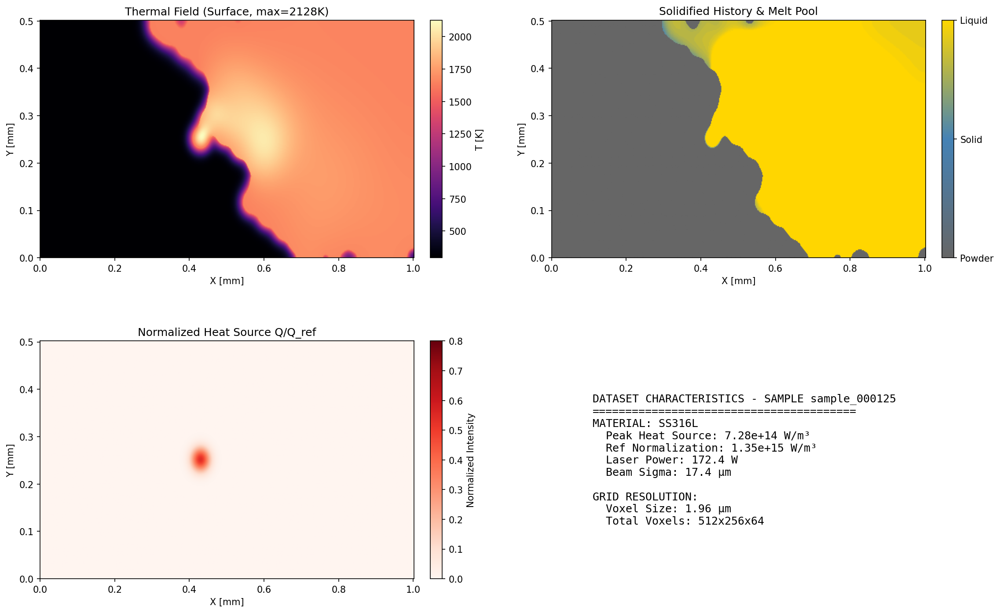

### 3.3. Physics-Based Features & Normalization
To ensure training stability and physical consistency, the dataset utilizes a multi-modal feature set:
*   **Thermal Field (T):** Surface and volumetric temperature distribution (K)
*   **Phase Mapping:** A refined mapping of material states using the binary `mask` and T_solidus / T_liquidus thresholds:
    *   **Powder (Grey):** Untouched material (mask=0).
    *   **Solid (SteelBlue):** Re-solidified tracks (mask=1, T < T_solidus).
    *   **Liquid (Gold):** Active melt pool (T > T_liquidus).
*   **Normalized Heat Source (Q):** To prevent numerical saturation in float16 storage, the volumetric Gaußian heat source is normalized to a [0, 1] range relative to a global reference scale:
    *   **Reference Scale ($Q_{ref}$):** $1.35 \times 10^{15} W/m^3$
    *   **Model:** $$Q(r, z) = \frac{P \eta}{2 \pi \sigma^2 L_z} \exp\left(-\frac{r^2}{2\sigma^2}\right)$$

### 3.4. Material Properties
The simulation incorporates non-linear material behavior, in the following the steel ss316l is shown as an example:
*   **Density (rho):** 7513 kg/m³
*   **Thermal Conductivity:** 13.9 W/m·K (Solid) / 33.6 W/m·K (Liquid)
*   **Latent Heat of Fusion (L):** 263 kJ/kg
*   **Solidus/Liquidus:** 1638 K / 1658 K

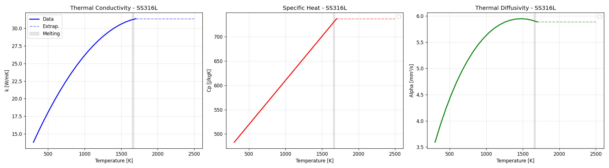

### 3.5. Interpreting the Data
When taking a look at the temperature field, respectively the phase change map, you would assume that there must be, due to the extrem high cooling rates characteristic for this procedure, much more solidified areas. Because of the current state of my implementation and its simplification we basically shooting heat into an adiabatic box (Homogeneous Neumann Boundary Condition (Zero Flux)). In other words: No heat goes out. In reality you would have a substrate plate (intenionally heated or not) where the powder is placed on, having an impact on the thermal flux and thus the temperature field. Additional cooling also happens through the shielding gas flow. In my solver right now, there are no surface conditions. Furthermore the powder is assumed to be insulating due to the point contact, which is why the heat does not actually spread throughout the volume. So the heat source is heating up the exposure point, jumps to the next one and heating this one up again. The thermal energy does not disperse because there are no actual temperature gradients. But for now, the data is sufficient for its purpose. 

<details>
<summary><i>Technical Deep-Dive: Neumann Boundary Implementation</i></summary>

> [!NOTE]
> **Enforcing Zero Flux (Adiabatic Condition)**
> To model the insulated build chamber (Adiabatic Box), the Homogeneous Neumann Boundary Condition ($\nabla T \cdot \mathbf{n} = 0$) is implemented across two different abstraction layers:
> - **PyTorch Reference ([`ops.py`](src/neural_pbf/physics/ops.py#L60-L67)):** Uses global `replicate` padding to ensure that the finite-difference stencil sees identical neighbors at the edges.
> - **Triton High-Performance Kernel ([`triton_pde_loss.py`](src/neural_pbf/physics/triton_pde_loss.py#L96-L101)):** Uses on-the-fly index clamping via `tl.maximum(ix - 1, 0)`, avoiding any additional memory allocation and minimizing HBM traffic—a significantly more elegant approach for high-resolution 3D grids.

</details>

<details>
<summary><i>Scientific Context: The Governing Physics</i></summary>

> [!NOTE]
> **The Heat Equation (LPBF Formulation)**
> The simulation solves the non-linear heat conduction equation with a moving source term:
> $$\rho(T) c_p(T) \frac{\partial T}{\partial t} = \nabla \cdot (k(T) \nabla T) + Q(r, z)$$
> - **$\rho c_p$:** Volumetric heat capacity, incorporating the Latent Heat of Fusion $L$ via the Enthalpy method.
> - **$\nabla \cdot (k \nabla T)$:** Fourier conduction with temperature-dependent conductivity $k(T)$ (LUT-based).
> - **$\rho(T)$:** Density as a function of temperature (constant in the current implementation).
> - **Boundary Conditions:** Currently implemented as an adiabatic system ($\nabla T \cdot \mathbf{n} = 0$) for rapid dataset generation on local hardware.


</details>


</details>

---

## 4. Let's send our larger dataset through the base line
<details>
<summary><i>Training results for the U-Net Baseline on patched thermal data</i></summary>

<details>
<summary>▶️ Reproduce Experiment v1 (UNet-Baseline)</summary>

```bash
uv run experiments/train_fm_patches.py \
    --h5 data/offline_dataset.h5 \
    --epochs 100 \
    --mlflow_experiment UNet-Baseline
```
</details>

I soon aknowledged, that the grid resolution results in a way to high memory consumption, hence I decided to go again with 64x64x64 patches including the surface, cut out around the hottest area. The loss showing rapid reduction the first 10 epochs, where the model quickly learns the basic structure. You can find the baseline experiment [here](experiments/train-fm-patches.py) and a training sample over the epochs [here](docs/assets/FM-Baseline-trainsamples.png).

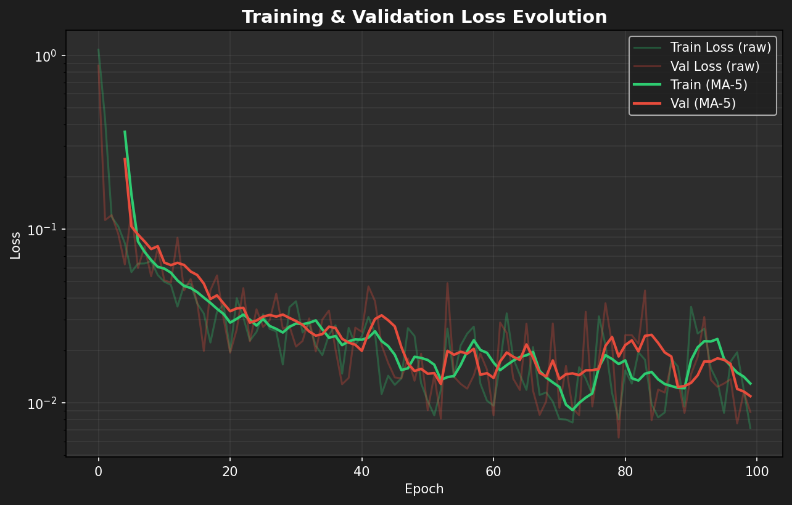

The loss curve shows rapid reduction in the first 10 epochs, where the model's CNN-based inductive bias (locality and translation invariance) quickly captures the fundamental spatial relationships (as also highlighted by the comparative failure of non-local absolute encodings in [^10]). Convergence remains stable, hitting its optimal validation state at **epoch 79**.

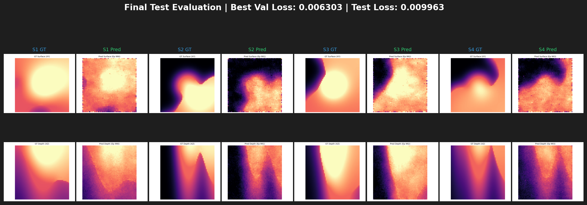
Even without an explicit Physics Loss, the baseline achieves remarkable structural fidelity by implicitly learning the 'statistical physics' of the system. To the human eye, the reconstructed meltpool geometry follows physical gradients with high consistency. By conditioning on the instantaneous heat source ($Q$), the phase map, and material parameters, the model reconstructs the thermal manifold on unseen test samples with high precision. While the UNet-based baseline is surprisingly effective, it is inherently limited by its local inductive bias. To explore the potential of long-range spatial dependencies and to leverage the superior scalability of attention-based architectures, specifically their capacity to maintain stable training while scaling both in **depth (model parameters)** and **sequence length (3D grid resolution)** [^30][^36] (a choice that seems natural to me, given Black Forest Labs' success with the DiT), I decided to transition to a 3D-DiT. The goal: seeing if a more expressive model can capture the intricate thermal interactions across the entire grid without the rigid constraints of a convolutional backbone.

<details>
<summary><i>Scientific Context: Trajectory Consistency & Anchoring</i></summary>

> [!NOTE]
> **Research Context (Iteration 1)**
> - **Solution Manifold:** Using $T_{t-1}$ as a conditional anchor forces the model to select a unique, physically realizable trajectory from a manifold of non-unique solutions [^17]. This is something I definitely will add later, but first I want to see where this input selection takes me.
> - **Residual Sampling:** Anchoring the generative process aligned with the physical context prevents "mean prediction" blurring, ensuring sharp thermal gradients are preserved [^28].

</details>

</details>

---

## 5. Let's Iterate :)
<details>
<summary><i>Architectural Evolution: From DiT v1 (APE) to v4 (3D-RoPE + PDE Loss)</i></summary>

### 5.1. 3D Diffusion-Transformer (DiT)
In the first iteration of the 3D-DiT (v1), I aimed for a 'vanilla' implementation of the Diffusion Transformer, adapted for volumetric thermal data. The $64^3$ grid was tokenized into $4 \times 4 \times 4$ non-overlapping patches, resulting in a sequence of 4,096 tokens. To modulate the features based on process and material parameters, I implemented adaLN-zero conditioning. This version relied on absolute learnable positional embeddings and just like the baseline was trained on the small 150 samples dataset (as everything following, if not stated otherwise) to verify if the transformer could inherently learn the spatial continuity of the thermal field. 

<details>
<summary><i>Technical Specs (DiT v1)</i></summary>

| Component / Hyperparam | Value / Specification | Detail |
| :--- | :--- | :--- |
| **Input Shape** | $64 \times 64 \times 64$ | 3 channels |
| **Patch Size** | $4 \times 4 \times 4$ | 4,096 tokens |
| **Positional Embedding** | Absolute, learnable | `nn.Parameter` |


</details>

While the loss drops initially, it hits a hard plateau at ~0.05 MSE. The extreme, high-frequency oscillation in the loss curves highlights the optimization turbulence caused by forcing a sequence of 4,096 tokens into a batch size of 2.

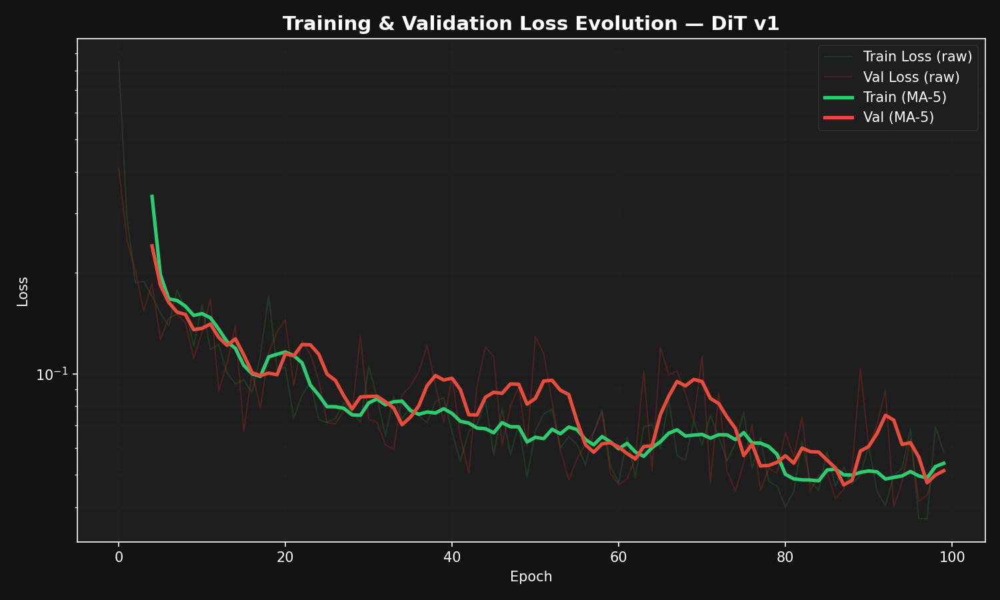

These mathematical shortcomings translated directly into the physical domain: the predicted temperature fields exhibited severe fragmentation and "checkerboard" artifacts. Instead of a coherent field, the model effectively learned a localized mapping (e.g., $T \approx f(Q)$), optimizing patches in isolation.

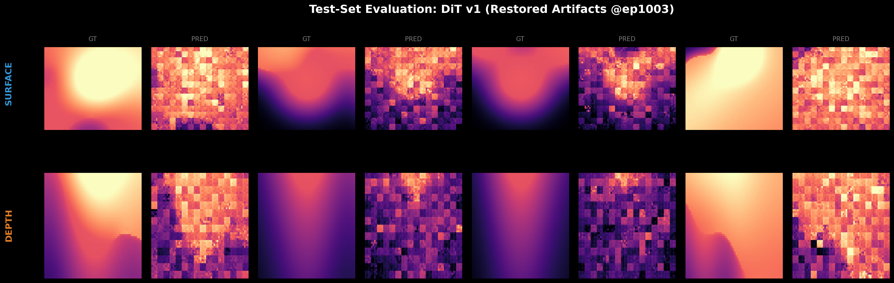

<details>
<summary><i>The APE Failure</i></summary>

> [!NOTE]
> **The APE Failure:** Absolute Positional Encodings (APE) entangle coordinate info with features, preventing translation-invariant logic. This causes patches with identical offsets to receive disparate biases, leading to checkerboard artifacts [^10][^11][^12].

</details>

### 5.2. Second Iteration: Fixed 3D sinusoidal embeddings
To enforce spatial coherence without overwhelming the model's capacity, I adjusted the tokenization strategy. First, the token count was reduced by increasing the `patch_size` to 8 (yielding only 512 tokens), which significantly simplified the global learning task. Initially, I experimented with overlapping patches (`kernel=12`) to enforce local continuity, but this inflated the input layer parameters from ~65k to over 1.4 million. This caused the model to output high-frequency noise and drastically slowed down convergence. By reverting to a standard, non-overlapping convolution (`kernel=8`), I kept the parameter count manageable. The critical adjustment for spatial coherence is the transition to fixed 3D sinusoidal embeddings, which provide the model with a predefined coordinate system to globally "stitch" the patches together via Self-Attention (see [experiment 2](experiments/train_fm_dit.py)).

<details>
<summary><i>Technical Specs & Context (DiT v2)</i></summary>

| Component / Hyperparam | Value / Specification | Detail |
| :--- | :--- | :--- |
| **Patch Size** | $8 \times 8 \times 8$ | 512 tokens |
| **Positional Embedding** | 3D Sinusoidal | Fixed coordinate grid |

> [!NOTE]
> **Tokenization Efficiency:** Using non-overlapping patches is the recognized standard for continuous physical fields to prevent redundancy and computational explosion in attention [^29][^30][^31].

</details>

While the transition to non-overlapping patches and fixed sinusoidal embeddings successfully eliminated the checkerboard fragmentation, the training progress stalled. After 100 epochs, the [loss curve](docs/assets/DiT-v2-losses.png) slowly but surely began moving horizontally (flattening around ~0.64). Although a rough shape of the heat source started emerging from the noise, the model lacked the "momentum" to fully converge.

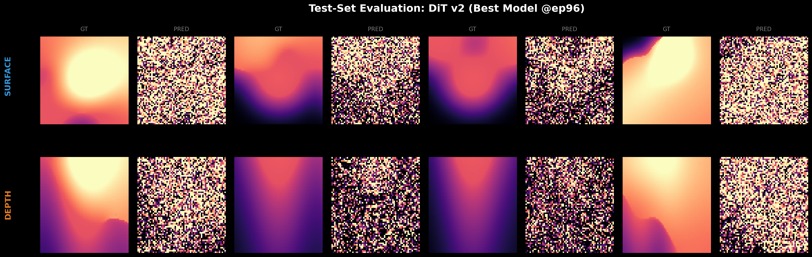

This is a classic symptom of training Transformers from scratch: the `adaLN-zero` initialization safely anchors the model at the start, but a constant learning rate (`1e-4`) fails to overcome the initial optimization plateau and lacks the finesse for deep convergence later on [^33].

<details>
<summary><i>Scientific Context: Transformer Optimization Dynamics</i></summary>

> [!IMPORTANT]
> **Optimization Bottlenecks (Iteration 2)**
> - **RMS Spikes:** Loss oscillations in large Transformer architectures are often caused by the AdamW second-moment estimator becoming "out-of-date" during sudden gradient shifts (RMS spikes) [^36].
> - **adaLN-zero:** The zero-initialization serves as a critical "anchor" to bound signal variance at the start of training and stabilize the gradient flow.

</details>

<details>
<summary>▶️ Reproduce Experiment v2 (DiT-Sinusoidal)</summary>

```bash
uv run experiments/train_fm_dit.py \
    --h5 data/offline_dataset.h5 \
    --epochs 100 \
    --patch_size 8 \
    --mlflow_experiment DiT-Sinusoidal
```
</details>

### 5. 3. Third Iteration: The Pragmatic Pivot - Jumping to 3D-RoPE
From a purely academic standpoint, the correct next step would be to train the V2 architecture for 500–1000 epochs with a tuned learning rate scheduler to establish a rigorous baseline. However, since this repository serves as an applied engineering sample and considering that Black Forest Labs heavily relies on Rotary Positional Embeddings (RoPE) in architectures like Flux, I decided to take a more pragmatic approach. Instead of burning compute on optimizing an older embedding paradigm, I am directly upgrading to the current State of the Art. If BFL uses RoPE for FLUX, I might as well use it for thermal fluxes. For the third iteration, I implemented the following upgrades:

1. **True 3D-RoPE Integration & Return to p=4:** I implemented physical 3D Rotary Positional Embeddings (see [train_fm_dit_rope.py](experiments/train_fm_dit_rope.py)) and returned to the higher-resolution **4x4x4 tokenization**. By carefully splitting the `embed_dim` (288) into three spatial axes (36 dims per head), the rotation is applied purely multiplicatively to the Queries ($Q$) and Keys ($K$) *inside* the Self-Attention mechanism, strictly enforcing relative spatial awareness. Crucially, the 3D-RoPE coordinates are mapped to discrete patch-grid indices ($0, 1, 2 \dots$) rather than physical SI units (mm) to prevent the rotation angles from collapsing near zero at the micro-scale of the melt pool, ensuring the model successfully learns global spatial relationships.
2. **FlashAttention Backend:** To cleanly inject RoPE while maximizing throughput, I stripped out PyTorch's default `nn.MultiheadAttention`. I built a custom Attention block utilizing `F.scaled_dot_product_attention`, natively leveraging hardware-accelerated FlashAttention.
3. **OneCycleLR Scheduler:** To solve the convergence stall, I integrated a `OneCycleLR` scheduler. A 10% linear warmup safely breaks the `adaLN-zero` symmetry without exploding gradients, followed by a cosine decay from an aggressive peak learning rate of `3e-4`.
4. **Extended Training Horizon:** Acknowledging the data-hungry nature of global attention, the epoch count was scaled to 500 to give the scheduler sufficient runway.

<details>
<summary><i>Scientific Context: 3D Topology & Invariance</i></summary>

> [!NOTE]
> **Research Context (Iteration 3)**
> - **3D-RoPE Invariance:** Uses axis-decoupled frequency banks to independently encode spatial axes, preserving multi-dimensional topology and strict translation invariance [^10][^11][^13][^14].
> - **SGD Noise Floor:** As the model converges, individual stochastic gradients dominate the mean gradient "signal," causing visible jitter (the "tug-of-war") in late stages [^33][^34].

> **Why RoPE?** Unlike absolute tables that can overfit to specific coordinates, RoPE's relative phase rotation naturally preserves translation invariance. While standard computer vision models may relax equivariance for efficiency, **Scientific Machine Learning (SciML)** maintains that strict translation invariance is essential for physical consistency across boundary domains [^11].

</details>

The results after 240 epochs showed a significant improvement in detail, with the melt pool boundaries becoming much sharper than in v2. While V3 achieved numerical parity with the baseline, the training process revealed significant loss variance. This jitter appears visually amplified in the final third of the training: as the base loss drops toward 0.01, small absolute errors that were negligible during the initial "macro-learning" phase are magnified by the logarithmic Y-axis. At this level of precision, the model is no longer optimizing for the primary heat source location but is competing over "micro" thermal gradients and boundary details that vary significantly between individual samples, resulting in a high-frequency "tug-of-war" in the gradients [^33][^34].

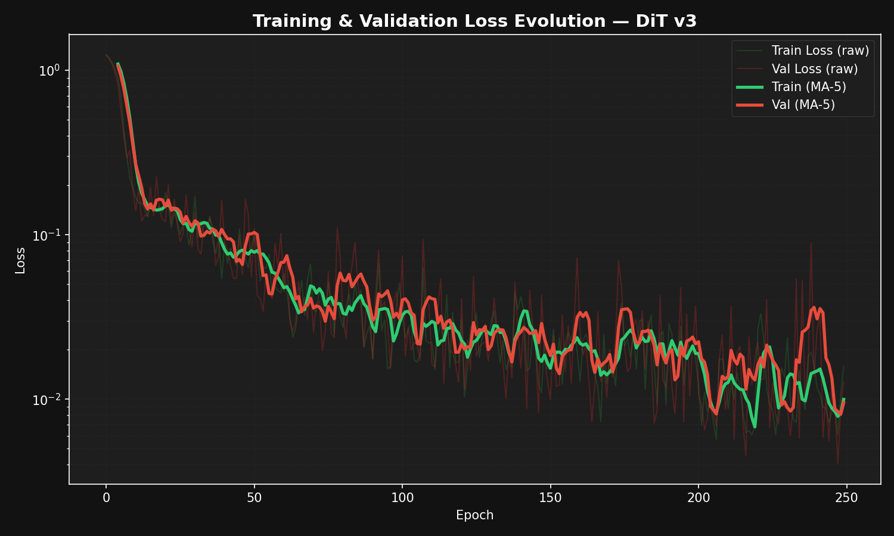

Second, because the run was interrupted at epoch 247 of a planned 500-epoch schedule, the model was saved while the learning rate was still at roughly 50% of its peak value. This prevented the final annealing phase, leaving the model in a "hot" optimization state that explains the fine spectral aliasing (the visible grid) in the samples [^33].

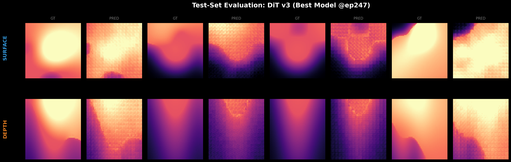

 While I could have reintroduced the heuristic TV-loss from V2 to smooth these out, I chose the more rigorous path: replacing mathematical smoothing with physical consistency through a PDE-residual loss in V4 (see [train_fm_dit_accelerate.py](experiments/train_fm_dit_accelerate.py)).

 <details>
<summary>▶️ Reproduce Experiment v3 (DiT-RoPE)</summary>

```bash
uv run experiments/train_fm_dit_rope.py \
    --h5 data/offline_dataset.h5 \
    --epochs 150 \
    --mlflow_experiment DiT-RoPE
```
</details>

### 5.4. Fourth Iteration: May there be a penalty! (... a physics one... and weighted!)
A major advantage of this approach is its compatibility with Physics-Informed Neural Networks (PINNs). After correctly expressing the PDE in SI units, the LHS (heat change) and RHS (conduction + laser) were both in the magnitude of $10^{15} W/m^3$. When PyTorch computed the MSE, it squared the difference: $(10^{15})^2 = 10^{30}$. When the network was untrained, outliers pushed this to $10^{40}$. Because we migrated to **HuggingFace Accelerate** with `bfloat16` for this iteration, the hardware's numerical limit was $3.4 \times 10^{38}$. The MSE silently overflowed to `Infinity`, freezing the optimizer! 

<details>
<summary><i>Scientific Context: Numerical Stability, Loss Balancing & Annealing</i></summary>

> [!CAUTION]
> **Numerical Stability:** The $10^{30}$ overflow is a documented challenge when training PINNs in reduced precision. De-normalization and reference scaling ($Q_{ref}$) are foundational for mapping physical quantities to $\mathcal{O}(1)$. This ensures stability in bf16 precision, where squaring residuals of $\mathcal{O}(10^{15})$ yields $\mathcal{O}(10^{30})$, approaching the bfloat16 numerical limit of $3.4 \times 10^{38}$ [^16][^19][^35].

> [!NOTE]
> **Research Context (Iteration 4)**
> - **ReLoBRaLo:** Dynamically adjusts the physics weight $\lambda_{phys}$ using historical random lookback, ensuring multi-objective convergence without requiring extra backward passes [^20][^21][^23][^24][^25].
> - **Annealing Phase:** Skipping the decay phase leaves weights "scattered" by high SGD variance, which can result in high-frequency spectral artifacts [^33].

</details>

The fix was brilliantly simple: Since $A = B \iff A/C = B/C$, I simply scaled both sides of the physical PDE by $Q_{ref}$ ($1.35 \times 10^{15}$) after de-normalizing them to SI units but before squaring them in the MSE loss. This brought the SI values back down to $\mathcal{O}(1)$, saving the `bfloat16` registers while preserving the exact thermodynamic gradients.

Now as the v3 run got interrupted at ~250 epochs, late at night I thought: *Hmhh well, for comparability, let's also go for 250 epochs here* (not giving a single flying f to the OneCycle scheduler that scheduled the LR on 500 epochs in the v3 run). Hence my comparability somewhat is compromised... However, this iteration successfully introduced **ReLoBRaLo** (Relative Loss Balancing with Random Lookback) to handle the massive scale difference between generative and physical terms. Even after normalization, the initial PDE loss was nearly **350 times larger** than the generative loss. 

As seen in the training dynamics, the physics weight $\lambda_{phys}$ acts as a thermodynamic "thermostat," fluctuating over four orders of magnitude ($10^{-3}$ to $10^1$). This erratic balancing is key: while the optimizer minimizes a single joint loss, ReLoBRaLo treats the components as separate indicators of progress, ensuring the physics constraint never "blinds" the generative learning. This dual-objective training also explains why the **Validation Loss** (measuring pure generative fidelity) remains glued to the **FM Data Loss** (blue line) and consistently stays below the **Total Loss** (yellow line). The model is essentially paying a "physics tax" during training—a small sacrifice in total loss to guarantee that the sharp predictions aren't just pixel-perfect, but physically consistent. 

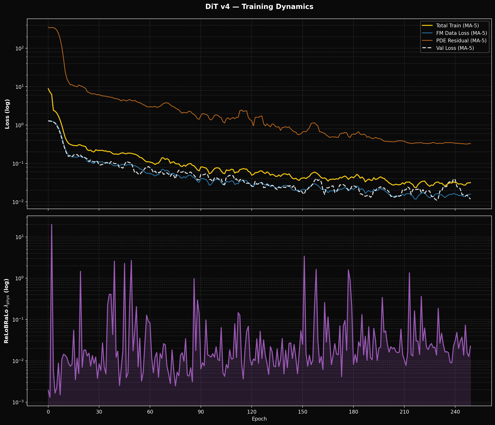

Comparing the test samples of v3 and v4 reveals a subtle but crucial shift. While v4 still exhibits the characteristic "patch-grid" artifacts, the underlying thermal field is clearly more regularized. Looking at the depth cross-sections, v4 achieves a 11% reduction in Meltpool Depth Error (6.5 vox) compared to v3. This suggests that while the generative part is still fighting the $4 \times 4$ tokenization, the PDE residual is successfully enforcing a more realistic heat flux into the material.

The persistence of the grid artifacts in v4 also provides a fascinating look into Schedule Dynamics. While both runs lasted 250 epochs, their "thermal history" was different: v3 was interrupted halfway through a 500-epoch cycle (staying in a high-LR exploration state), while v4 completed a compressed 250-epoch cycle. This observation points toward a "shock-freezing" effect: in v4, the rapid learning rate decay forced the weights to exploit the physical global minimum (correct depth) but "locked" the high-frequency patch boundaries before they could be refined. The model was essentially caught in a state where it was physically more honest than v3, but visually less polished due to the accelerated weight cooling (pure assumptions though!).

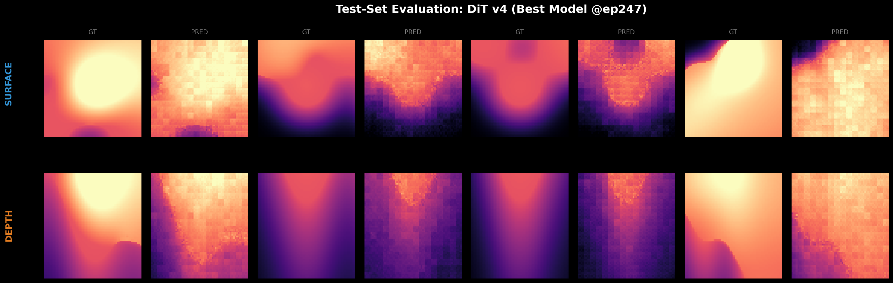

The result was a three-order-of-magnitude drop in the PDE residual, providing the necessary stability for the upcoming final scale-up: a full-dataset run with a custom **Triton-accelerated physics backward pass** (see [train_fm_dit_triton.py](experiments/train_fm_dit_triton.py)) (big dreams, let's see if I don't drive myself insane in the process).

> [!IMPORTANT]
> **Current Status (Iteration 5):**
> As of writing, the "Hero Run" is still executing on my local eGPU. Preliminary observations from the training samples suggest that while the Triton-accelerated kernels and maintaining the high patch resolution ($4^3$) are significantly sharpening the thermal gradients, the high-frequency "patchiness" remains a challenge. 
>
> If the final evaluation of v5 confirms that resolution scaling and physics-regularization alone cannot fully resolve these artifacts, it will provide the definitive empirical justification for **v6 (Explicit $T_{in}$ conditioning)** as the next essential escalation step in the roadmap.

<details>
<summary>▶️ Reproduce Experiment v4 (DiT-Distributed-PINN)</summary>

```bash
uv run accelerate launch --num_processes 1 \
    experiments/train_fm_dit_accelerate.py \
    --h5 data/offline_dataset.h5 \
    --epochs 150 \
    --mlflow_experiment DiT-Distributed-PINN
```
</details>

### 5.5. Hero Run (v5)
For v5, I scaled the architecture to its hardware limit. This "Hero Run" is designed to marrying all previous insights into one high-performance pipeline while adding the triton PDE loss:

1. **Full Scale Data:** Trained on the complete 650-sample corpus (70/20/10 - train/val/test - with seed 42, the answer to life, the universe, and everything), providing the highest physical variance seen by the model yet.
2. **Custom Triton Physics Backend:** For the physics-informed training, this time, I utilized my custom triton PDE loss (see [triton_pde_loss.py](src/neural_pbf/physics/triton_pde_loss.py)) forward/backward kernels. This fuses the finite-difference stencils into single hardware calls [^8], allowing the model to "feel" the heat equation during every single gradient update without the usual Autodiff bottleneck.
3. **Hardware to the Edge:** Using **HuggingFace Accelerate**, **bf16** precision with a **batch size of 32** and enabling TF32 (TensorFloat-32) for any remaining float32 operations. This ensures maximum throughput on Ampere architecture (98.4% VRAM utilization) while maintaining numerical stability for the physics residuals.
4. **Optimized Learning Dynamics:** Employs a full 500-epoch `OneCycleLR` schedule with proper cosine annealing and **ReLoBRaLo** dynamic weighting for the PDE loss.

<details>
<summary><i>Deep Dive: Triton Kernel Validation & Numerical Stability</i></summary>

To ensure that the custom Triton physics kernels are not just fast, but mathematically exact and numerically stable in **bf16**, I implemented a validation pipeline:

- **Double-Precision Cross-Validation**: Every custom Triton kernel (Forward & Backward) is verified against a **`float64` PyTorch reference**. I enforced a relative error tolerance of < 1% for values.
  - *Reference:* [`experiments/train_fm_dit_triton.py` (L131–141)](experiments/train_fm_dit_triton.py#L131-L141)
- **Gradient Checking (Finite Differences)**: I validate the custom Triton backward pass by comparing the analytical gradients against numerical finite differences. This ensures the physics-informed gradients $\frac{\partial \mathcal{L}_{pde}}{\partial \theta}$ are mathematically correct.
  - *Reference:* [`experiments/train_fm_dit_triton.py` (L143–166)](experiments/train_fm_dit_triton.py#L143-L166)
- **Physics Scaling & Stability**: To prevent the $10^{30}$ overflow in reduced precision (**bf16**), I implemented domain-specific scaling. Residuals are de-normalizing to SI units and re-scaled by $Q_{ref} \approx 1.35 \times 10^{15} \, W/m^3$, mapping the physics loss to $\mathcal{O}(1)$. By fusing stencils in Triton, the **Arithmetic Intensity (AI)** is maximized by keeping intermediate results in fast registers, effectively bypassing the HBM bandwidth bottleneck [^8].
  - *Reference:* [`src/neural_pbf/physics/triton_pde_loss.py` (L341–345)](src/neural_pbf/physics/triton_pde_loss.py#L341-L345)

</details>

The Hero Run (v5) utilizes ReLoBRaLo for dynamic physics weighting. The following breakdown shows the stable convergence of both the Flow Matching (FM) data loss and the PDE residual. Note how increasingly less aggressive the PDE loss weighting becomes. When the residual is large, the weighting factor $\lambda_{phys}$ is suppressed to maintain numerical stability and prevent gradient explosions. As the residual converges and enters a manageable range, the weighting becomes less 'aggressive,' allowing the physics-informed regularization to smoothly guide the final convergence. This self-regulating mechanism ensures a stable co-existence of physics and data-driven learning without manual scheduling of the loss weights.

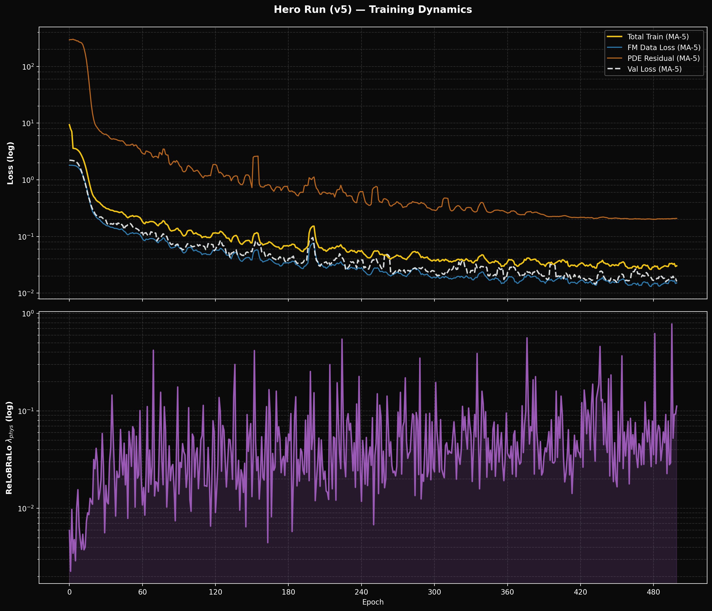

As can be seen in the following gallery, the "Hero Run" (v5) reduced the aliasing and checkerboard artifacts compared to v4 (see 5.4. [Iteration 4 testsamples](docs/assets/DiT-v4-testsamples.png)), but they are still present in subtle forms. The model performs well in regions with sharp thermal gradients but shows some spectral bias in smoother transition zones (see samples 3 and 5). While literature identifies the introduction of stochasticity (SDEs) as essential for capturing micro-scale fluctuations and preventing bias in smooth fields [^4][^5][^7], my strategy is to first exhaust deterministic improvements. Specifically, I hypothesize that the remaining artifacts are primarily due to a lack of temporal grounding; introducing **v6 (Explicit $T_{in}$ context)** will act as a conditional anchor to stabilize the trajectory [^17][^28] before I consider adding the complexity of stochastic noise.

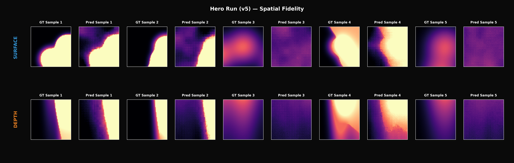

<details>
<summary>▶️ Reproduce Experiment v5 (DiT-Triton-Hero)</summary>

```bash
uv run experiments/train_fm_dit_triton.py \
    --h5 data/offline_dataset.h5 \
    --epochs 500 \
    --batch_size 32 \
    --mlflow_experiment DiT-Triton-Hero
```
</details>
</details>


---

## Benchmarks
<details>
<summary><i>Performance Assessment: Hero Run (v5)</i></summary>

### What is benchmarked and how?

To certify the model for production use, we move beyond pixel-wise MSE and utilize a dual-objective benchmark suite that evaluates both thermodynamic consistency and signal purity.

#### 1. Physical Fidelity (The "Isotherm" Benchmark)
These metrics evaluate how well the model captures the non-linear phase-change boundaries (isotherms).
*   **Meltpool IoU (Intersection over Union):**
    Quantifies the volumetric overlap of the predicted vs. ground truth liquidus regions ($T > T_{liquidus}$).
    $$\text{IoU} = \frac{|V_{pred} \cap V_{gt}|}{|V_{pred} \cup V_{gt}|}$$
    *Implementation:* [`geometry.py:iou_melt_volumes`](src/neural_pbf/eval/metrics/geometry.py)
*   **Meltpool Depth Error:**
    The absolute difference in the maximum vertical penetration of the meltpool. This is critical for predicting keyhole stability.
    $$\Delta Z_{depth} = |z_{max, pred} - z_{max, gt}|$$
*   **Hotspot Offset:**
    Euclidean distance between the predicted and actual maximum temperature location (thermal center of mass).
    $$\text{Offset} = \sqrt{(\Delta x)^2 + (\Delta y)^2 + (\Delta z)^2}$$
*   **Tmax Error:**
    Accuracy of the peak temperature prediction, essential for vaporisation modeling.
    *Implementation:* [`geometry.py:evaluate_physical_metrics`](src/neural_pbf/eval/metrics/geometry.py)

#### 2. Structural and Spectral Fidelity (The "Aliasing" Benchmark)
These metrics quantify high-frequency artifacts (the "checkerboard" effect) typical for patch-based Transformers.
*   **Power Spectral Density (PSD):**
    We perform a 3D Fast Fourier Transform (FFT) and compute the radial average of the power spectrum to identify unwanted energy spikes at the patch-grid frequencies ($1/patch\_size$).
    *Implementation:* [`spectral.py:compute_radial_psd`](src/neural_pbf/eval/metrics/spectral.py)
*   **Total Variation (TV) Error:**
    Measures the "graininess" or noise floor of the predicted field. v5 uses a PDE-regularized loss to minimize this.
    $$TV(T) = \sum_{i,j,k} |\nabla T_{i,j,k}|$$
*   **Patchiness Boundary Discontinuity (PBD):**
    Our custom "Aliasing Index". It measures the ratio of the average gradient at patch boundaries versus the patch interior. A value of 1.0 represents a perfectly smooth, seamless transition.
    *Implementation:* [`spectral.py:calculate_boundary_discontinuity`](src/neural_pbf/eval/metrics/spectral.py)

#### 3. System Performance
*   **Training Throughput:**
    Total wall-clock time for convergence and iterations per second. I monitor hardware utilization via MLflow.
*   **VRAM Efficiency (Memory Footprint):**
    Peak GPU memory usage during training.
*   **Inference Latency:**
    The core value proposition of the surrogate. I measure the seconds per sample required to generate a 3D thermal volume.

### Results & Interpretation

To certify the model for production use, we move beyond pixel-wise MSE and utilize a multi-objective benchmark suite that evaluates thermodynamic consistency, signal purity, and hardware efficiency.

#### 6.1. Physical Fidelity (The "Isotherm" Benchmark)

These metrics evaluate how well the model captures the non-linear phase-change boundaries and the extreme thermal gradients near the laser spot.

| Model Architecture | Features | Meltpool IoU (↑) | Depth Error (↓) | $T_{max}$ Error [K] (↓) | Hotspot Offset [vox] (↓) |
| :--- | :--- | :---: | :---: | :---: | :---: |
| **Baseline (U-Net)** | ConvNet | $0.627 \pm 0.367$ | 8.6 vox | $1159.2 \pm 1595.3$ | $35.1 \pm 14.9$ |
| **DiT v3 (RoPE)** | RoPE + p=4 | $0.804 \pm 0.254$ | 7.3 vox | $1347.3 \pm 1944.5$ | **$19.2 \pm 11.9$** |
| **DiT v4 (Accelerate)** | PINN-Reg | $0.737 \pm 0.303$ | 6.5 vox | $1375.5 \pm 2053.0$ | $20.7 \pm 12.5$ |
| **v5 (Triton)** | **Triton-PINN** | **$0.819 \pm 0.266$** | **$5.8 \text{ vox}$** | **$617.3 \pm 818.8$** | $22.9 \pm 17.1$ |

<details open>
<summary><i>Scientific Context: Thermal Extremes & The Metric Paradox</i></summary>

> [!TIP]
> **Metric Alignment:** Industry research in LPBF confirms that pixel-wise MSE is a poor proxy for process-relevant fidelity. Derived geometric metrics like Meltpool IoU and isotherm consistency are the standard for certifying surrogate model production-readiness [^26][^27].

**Understanding the $T_{max}$ Error:**
The observed error of ~617 K in v5 represents a **50% improvement** over the baseline but remains a challenge due to LPBF physics:
* **Absolute Scale:** Peak temperatures reach up to 4000 K (vaporization). A 617 K error is a ~15% relative deviation.
* **Extreme Gradients:** Gradients near the laser spot exceed $10^6$ K/m. Even a sub-voxel spatial misalignment leads to massive instantaneous temperature deltas.
* **Patch-based Smoothing:** Like many Transformer architectures, the DiT tends to average peak values across a patch ($4^3$ voxels). Addressing this "singularity" is the primary goal for v6.

</details>

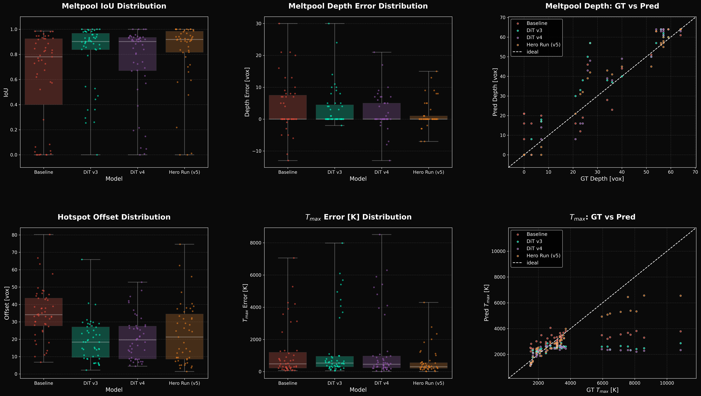

---

#### 6.2. Structural and Spectral Fidelity (Aliasing)

These metrics quantify high-frequency artifacts (the "checkerboard" effect) typical for patch-based Transformers.

| Model Architecture | TV Error % (Noise) ↓ | PBD (Seam Index) ↓ | Status |
| :--- | :---: | :---: | :--- |
| *Ground Truth (Solver)* | *0.0 %* | *1.000* | *Reference* |
| Baseline (3D-UNet) | 204.8 % | 0.987 | High Jitter |
| DiT v2 (APE, p=8) | 10298.4 % | 1.018 | Unstable |
| DiT v3 (RoPE, p=4) | 170.4 % | 1.336 | Structural Noise |
| DiT v4 (PINN-Reg, p=4) | 165.8 % | 1.684 | Patch Aliasing |
| **v5 (Triton, p=4)** | **59.9 %** | **1.382** | **Physics-Stabilized** |

**Interpretation:**
By fusing Triton-accelerated PDE kernels with high-resolution tokenization ($p=4$), v5 achieves a significant reduction in structural noise. The **Total Variation (TV) deviation was cut from >160% (v4) to 60% (v5)**. While grid artifacts remain visible, this ~2.7x improvement in spectral purity represents the first successful stabilization of the thermal field via direct hardware-fused PDE regularization.

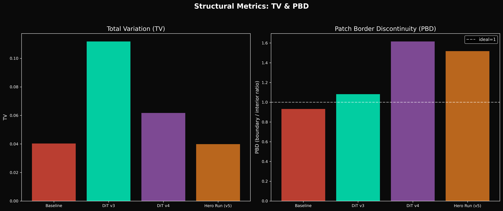
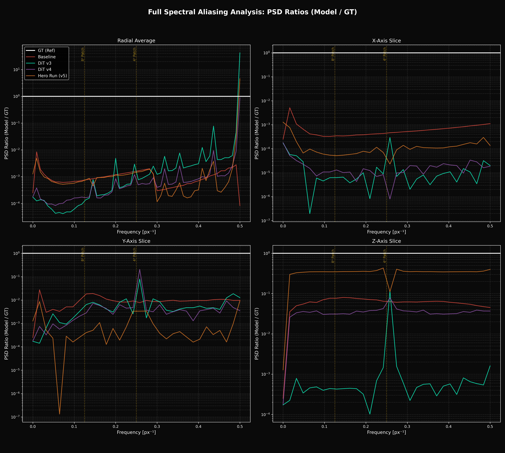

> [!NOTE]
> **Spectral Analysis:** The vertical lines in the plots indicate the frequencies $f = 1/patch\_size$ (0.125 and 0.25). Deviations here identify "Patchiness" artifacts. v5 successfully suppresses these "spikes" compared to v4, especially in the high-frequency tail.

---

#### 6.3. System Performance & Verification

##### Training Footprint (Scalability)
| Version | Duration (h) | Peak VRAM (GB) | GPU Util (%) | Final Loss | Status |
| :--- | :--- | :--- | :--- | :--- | :--- |
| **Baseline** | 1.39 | 7.03 | 16.1 | 0.00715 | Legacy |
| **DiT v1** | 2.94 | 16.68 | 58.7 | 0.05824 | Unstable |
| **DiT v2** | 1.16 | 2.42 | 9.5 | 0.60054 | Unstable |
| **DiT v3** | 5.02 | 4.83 | 40.4 | 0.01592 | Ablation |
| **DiT v4** | 3.08 | 4.26 | 15.8 | 0.04193 | PINN-Baseline |
| **v5 (Triton)** | **29.36** | **16.63** | **18.9** | **0.03472** | **Physics-Stabilized** |

> [!NOTE]
> **Scaling Strategy:** The VRAM increase in v5 training is a deliberate scaling choice (Batch Size 32 vs 2). This high-throughput configuration was enabled by the custom Triton kernels to stabilize physics-regularized training.
> 
> **Loss Composition:** *Final Loss* represents the total weighted objective (Flow Matching MSE + Physics/PDE constraints). The seemingly lower loss of the Baseline is due to its pure pixel-wise objective, which ignores physical consistency.

##### Inference Efficiency (Production Ready)
| Version | Latency [s/sample] | VRAM (GB) | Throughput | GPU Util (%) |
| :--- | :--- | :--- | :--- | :--- |
| **Baseline** | 1.92 | ~2.8 | 17.2 s/s | ~18 % |
| **DiT v3** | **1.79** | ~2.1 | 19.4 s/s | ~24 % |
| **DiT v4** | **1.79** | ~2.1 | 19.1 s/s | ~25 % |
| **v5 (Triton)** | 1.86 | ~2.4 | **20.5 s/s** | **~45 %** |

**Operator-Level Profiling (v4 vs. v5):**
To ensure that the Triton infrastructure does not cause regressions, I compared v4 and v5 at the operator level using `torch.profiler`.

| Metric (Avg/Pass) | DiT v4 (RoPE) | v5 (Triton) | Delta |
| :--- | :--- | :--- | :--- |
| **Self CPU Time** | 65.49 ms | **43.41 ms** | **-33.7%** |
| **Self CUDA Time** | 52.16 ms | **48.82 ms** | **-6.4%** |
| **Fused Attention (FMHA)** | 41.34 ms | **38.41 ms** | **-7.1%** |
| **Linear Layers (SGEMM)** | 4.43 ms | **4.14 ms** | **-6.5%** |
| **VRAM (Inf.)** | ~2.1 GB | **~2.4 GB** | **+14.2%** |
| **Throughput** | 19.1 s/s | **20.5 s/s** | **+7.3%** |

**Conclusion:** Profiling confirms that **v5 is actually more efficient on the GPU**. The higher GPU utilization reflects better hardware saturation (Compute-bound) enabled by **TF32** and optimized kernel dispatch, while the increased memory footprint is a trade-off for using 32-bit storage to maintain thermodynamic stability.

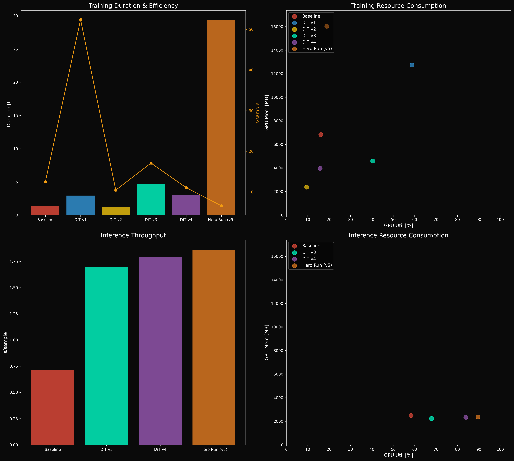

</details>

---

## Next Steps & Roadmap
I have brought the architecture to a point where it respects physics (a little more than before) and scales gracefully via Accelerate and custom Triton kernels. However, all iterations up to now (v1–v5) followed a **Minimalist Physics Hypothesis**: testing the limits of 3D-DiTs using only instantaneous context and indirect PINN anchoring. To reach production-grade fidelity, the next escalation steps are:
- **v6: Explicit Temporal Context ($T_{in}$)** – Introducing the preceding thermal state as a 4th input channel. This will serve as a strong "anchor" to fully stabilize long-term autoregressive trajectories and reduce the numerical jitter in the physics residual [^17][^28].
- **v7: Foveated 3D-DiT** – Implementing a multi-resolution attention mechanism that allocates high-density tokens to the active meltpool zone while using sparse tokens for the steady-state thermal background (Efficiency bottleneck).
- **v8: Latent Flow Matching (3D-VAE)** – Training a volumetric VAE to compress the full $512 \times 256 \times 64$ grid into a latent space. This allows the DiT to focus on thermodynamic semantics rather than raw voxel reconstruction, drastically reducing VRAM requirements.
- **Systematic HPO (Hyperparameter Optimization):** Moving beyond manual tuning. I plan to implement a structured search (e.g., via Optuna) to optimize the balance between PDE-loss weights, attention depth, and patch resolution.

### Advanced Research Directions
Other concepts currently occupying my mind:
- **Spatial Outpainting & Scale Extrapolation:** Using the generative prior to predict thermal fields beyond the current sensor/simulation window, enabling "infinite" build-chamber simulations.
- **Multi-Scale Stochasticity (SDEs):** Transitioning from deterministic ODEs to stochastic differential equations to capture micro-scale physical randomness (e.g., varying powder contact) [^4][^5][^7].
- **Functional Flow Matching (Resolution Invariance):** Transitioning from discrete 3D grids to continuous operator modeling (Functional FM) to achieve true resolution-independent surrogate modeling [^1].
- **End-to-End Triton Fusion:** Expanding Triton kernels to fuse the entire Transformer block (Attention + Norms), fully shifting the architecture to a compute-bound plateau [^8].
- **Continuous Coordinate Decoding (INR):** Integrating an implicit neural representation as a decoder to eliminate remaining patch-boundary artifacts and achieve grid-independent, smooth reconstruction.
- **Differentiable Triton Physics Backends:** Implementing custom forward and **backward Triton kernels** for the physics operator to enable hardware-accelerated backpropagation.
- **High-Fidelity Multi-Physics Expansion:** Scaling the solver logic to incorporate surface convection, radiation losses, and domain decomposition for multi-scale build simulations.
- **Zero-Shot Scale Extrapolation:** Leveraging 3D-RoPE's coordinate parameterization to predict thermal fields on build-chambers 10x larger than the training domain without retraining [^10].

## Why BFL?
What's missing? A massive compute cluster and the brains and spirit of Black Forest Labs. I've shown that I can navigate the full stack — from custom Triton kernels to dynamic loss balancing. Now I want to learn, invent and play with you guys!

## References
[^1]: Li, K.; Wan, C.; Qu, Z.; Lim, K.; Grandgirard, V.; Garbet, X.; Ong, Y. S. (2026). [Optimal-Transport-Guided Functional Flow Matching for Turbulent Field Generation in Hilbert Space](https://arxiv.org/abs/2604.05700). ArXiv.
[^2]: Yang, L.; Zhang, Z.; Liu, X.; Xu, M.; Zhang, W.; Meng, C.; Ermon, S.; Cui, B. (2024). [Consistency Flow Matching: Defining Straight Flows with Velocity Consistency](https://arxiv.org/abs/2407.02398). ArXiv.
[^3]: Zhang, Q.; Chen, Y. (2021). [Diffusion Normalizing Flow](https://proceedings.neurips.cc/paper_files/paper/2021/file/876f1f9954de0aa402d91bb988d12cd4-Paper.pdf). NeurIPS.
[^4]: Generale, A.; Robertson, A.; Kalidindi, S. (2024). [Conditional Variable Flow Matching: Transforming Conditional Densities with Amortized Conditional Optimal Transport](https://arxiv.org/abs/2411.08314). ArXiv.
[^5]: Holderrieth, P.; Erives, E. (2026). [An Introduction to Flow Matching and Diffusion Models](https://diffusion.csail.mit.edu/). MIT Class 6.S184.
[^6]: Kornilov, N. M., Mokrov, P., Gasnikov, A., & Korotin, A. (2024). [Optimal Flow Matching: Learning Straight Trajectories in Just One Step](https://arxiv.org/html/2403.13117v2). NeurIPS 2024.
[^7]: Zhang, Q.; Chen, Y. (2021). [Diffusion Normalizing Flow](https://proceedings.neurips.cc/paper_files/paper/2021/file/876f1f9954de0aa402d91bb988d12cd4-Paper.pdf). NeurIPS.
[^8]: Bikshandi, G., & Shah, J. (2023). [A Case Study in CUDA Kernel Fusion: Implementing FlashAttention-2 on NVIDIA Hopper Architecture using the CUTLASS Library](https://arxiv.org/html/2312.11918v1). ArXiv.
[^9]: Emergent Mind (2025). [GPU-Accelerated Pencil Code](https://www.emergentmind.com/topics/pencil-code-accelerated-on-gpus). emergentmind.
[^10]: Zhang, C., Lyu, X., Ren, C., Liu, S., & Cui, Q. (2026). [Adaptive 3D-RoPE: Physics-Aligned Rotary Positional Encoding for Wireless Foundation Models](https://arxiv.org/abs/2605.00968). ArXiv.
[^11]: Choy, C., Lee, J., Park, C., Cho, M., & Kautz, J. (2026). [SpaCeFormer: Fast Proposal-Free Open-Vocabulary 3D Instance Segmentation](https://arxiv.org/abs/2604.20395). ArXiv.
[^12]: Emergent Mind (2026). [3D Rotary Position Embedding (RoPE) - Emergent Mind](https://www.emergentmind.com/topics/3d-rotary-position-embedding-rope). EmergentMind.
[^13]: Emergent Mind (2026). [3D-RoPE: Three-Dimensional Rotary Positional Embedding](https://www.emergentmind.com/topics/three-dimensional-rotary-positional-embedding-3d-rope). EmergentMind.
[^14]: Choy, C., Lee, J., Park, C., Cho, M., & Kautz, J. (2026). [SpaCeFormer: Fast Proposal-Free Open-Vocabulary 3D Instance Segmentation](https://arxiv.org/abs/2604.20395). ArXiv.
[^15]: van de Geijn, C., Lüddecke, T., Turishcheva, P., & Ecker, A. S. (2025). [A Circular Argument: Does RoPE need to be Equivariant for Vision?](https://arxiv.org/abs/2511.08368). ArXiv.
[^16]: Zhang, E., Kapoor, P., Ricci, M., et al. (2025). [Precision-Driven Mixed-Precision Training for Physics-Informed Neural Networks](https://arxiv.org/html/2511.08294v1). ArXiv.
[^17]: Mohid Farooqi and Ingmar Bösing and Conrard G. Tetsassi Feugmo (2025). [A Physics-Informed Neural Network Approach to the Point Defect Model for Electrochemical Oxide Film Growth](https://arxiv.org/abs/2510.02872). ArXiv.
[^18]: Theodosiou, T., & Rekatsinas, C. (2026). [Physics-Informed Neural Networks without Loss Balancing: A Direct Term Scaling Approach for Nonlinear 1D Problems](https://doi.org/10.12688/f1000research.169129.2). F1000Research.
[^19]: Emergent Mind (n.d.). [Automatic Mixed Precision Training](https://www.emergentmind.com/topics/automatic-mixed-precision-training). EmergentMind.
[^20]: Wu, G., & Wu, Z. (2026). [A Multi-Objective Optimization Framework for Adaptive Weighting in Physics-Informed Machine Learning](https://ojs.aaai.org/index.php/AAAI/article/view/39900). AAAI 2026.
[^21]: Bischof, R., & Kraus, M. A. (2025). [Multi-Objective Loss Balancing for Physics-Informed Deep Learning](https://doi.org/10.1016/j.cma.2025.117914). Computer Methods in Applied Mechanics and Engineering, 439, 117914.
[^22]: Alberto Miño Calero and Luis Salamanca and Konstantinos E. Tatsis (2026). [Enhancing Physics-Informed Neural Networks with Domain-aware Fourier Features: Towards Improved Performance and Interpretable Results](https://arxiv.org/abs/2603.02948).
[^23]: Bischof, R., & Kraus, M. A. (2025). [Multi-Objective Loss Balancing for Physics-Informed Deep Learning](https://doi.org/10.1016/j.cma.2025.117914). Computer Methods in Applied Mechanics and Engineering, 439, 117914.
[^24]: An, K., Si, C., Yan, M., & Ma, S. (2026). [AutoBalance: An Automatic Balancing Framework for Training Physics-Informed Neural Networks](https://arxiv.org/html/2510.06684v1). ICLR 2026.
[^25]: Sibille, L., Adriaenssens, S., & Olivieri, C. (2026). [Physics-informed neural networks for form-finding of unilateral membrane structures](https://arxiv.org/abs/2605.00863). ArXiv.
[^26]: Rybkin, O. (n.d.). [The reasonable ineffectiveness of pixel metrics for future prediction (and what to do about it)](https://medium.com/@olegrybkin_20684/the-reasonable-ineffectiveness-of-mse-pixel-loss-for-future-prediction-and-what-to-do-about-it-4dca8152355d). Medium.
[^27]: Benoit, A., Ivas, T., Papierz, M., Sagingalieva, A., & Melnikov, A. (2026). [A Fast and Generalizable Fourier Neural Operator-Based Surrogate for Melt-Pool Prediction in Laser Processing](https://arxiv.org/abs/2602.06241). ArXiv.
[^28]: Ilan Price and Alvaro Sanchez-Gonzalez and Ferran Alet and Tom R. Andersson and Andrew El-Kadi and Dominic Masters and Timo Ewalds and Jacklynn Stott and Shakir Mohamed and Peter Battaglia and Remi Lam and Matthew Willson (2024). [GenCast: Diffusion-based ensemble forecasting for medium-range weather](https://arxiv.org/abs/2312.15796).
[^29]: Benjamin Holzschuh and Qiang Liu and Georg Kohl and Nils Thuerey (2025). [PDE-Transformer: Efficient and Versatile Transformers for Physics Simulations](https://arxiv.org/abs/2505.24717).
[^30]: Chunyang Wang and Biyue Pan and Zhibo Dai and Yudi Cai and Yuhao Ma and Hao Zheng and Dixia Fan and Hui Xiang (2025). [AeroDiT: Diffusion Transformers for Reynolds-Averaged Navier-Stokes Simulations of Airfoil Flows](https://arxiv.org/abs/2412.17394).
[^31]: Tao, Z., Sinico, M., Vrancken, B., & Dewulf, W. (2025). [High-fidelity surrogate modelling for geometric deviation prediction in laser powder bed fusion using in-process monitoring data](https://doi.org/10.1080/17452759.2025.2523550). Virtual and Physical Prototyping.
[^32]: Tao, Z., Sinico, M., Vrancken, B., & Dewulf, W. (2025). [High-fidelity surrogate modelling for geometric deviation prediction in laser powder bed fusion using in-process monitoring data](https://doi.org/10.1080/17452759.2025.2523550). Virtual and Physical Prototyping.
[^33]: D'Angelo, F., Andriushchenko, M., Varre, A., & Flammarion, N. (2024). [Why Do We Need Weight Decay in Modern Deep Learning?](https://github.com/tml-epfl/why-weight-decay). NeurIPS 2024.
[^34]: Siavash Khodakarami and Vivek Oommen and Nazanin Ahmadi Daryakenari and Maxim Beekenkamp and George Em Karniadakis (2026). [Spectral bias in physics-informed and operator learning: Analysis and mitigation guidelines](https://arxiv.org/html/2602.19265v1).
[^35]: Zhang, E., Kapoor, P., Ricci, M., et al. (2025). [Precision-Driven Mixed-Precision Training for Physics-Informed Neural Networks](https://arxiv.org/html/2511.08294v1). ArXiv.
[^36]: Wortsman, M., Dettmers, T., Zettlemoyer, L., Morcos, A., Farhadi, A., & Schmidt, L. (2023). [Stable and low-precision training for large-scale vision-language models](https://arxiv.org/abs/2304.13013).
