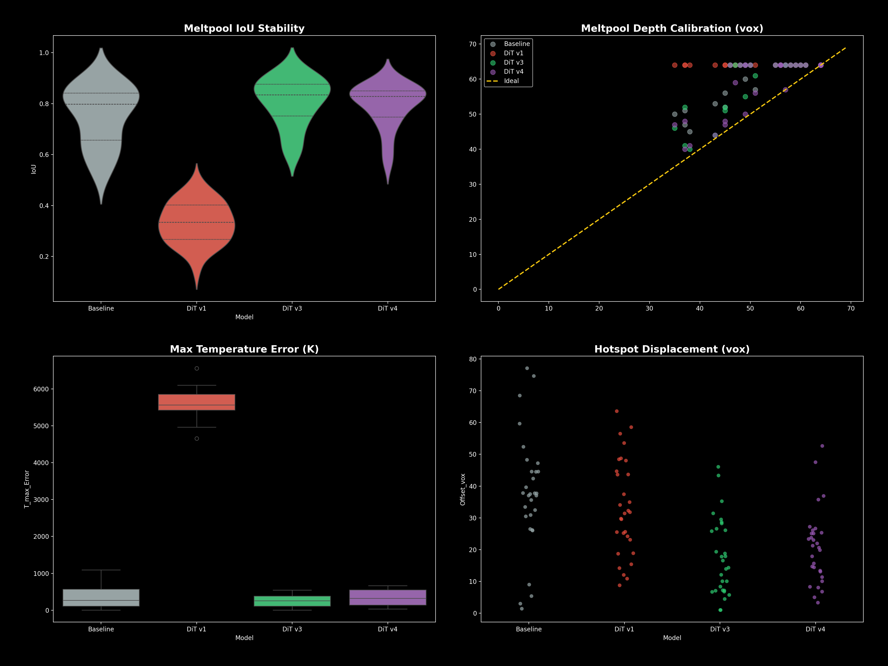

# Hi Black Forest Labs :) Glad you are here!

As I really wanna work with you I thought to myself to go on a little sidequest, eventough my first babysteps on the surrogate training in this repository are just done, and see how the flow matching approach could work with my Laser Powder Bed Fusion Simulation. As FM is one of the things that made you famous (and it is elegant af!), I wanna give it a go and see how it can be transfered.

Now! I found the guts to apply to this awesome vacancy. And then I thought: "Well, I have a solver, I walked my first surrogate steps, I understand the Conditional Flow Matching method, lets marry my surrogate ambitions with generative powers.". Why this could be a match? The beauty of FM lies in the deterministic coupling. By guiding the vector field with the previous state as an conditional anchor, we maintain physical consistency without sacrificing the generative flexibility of the FM approach. In other words: We don't just jump between plausible snapshots, but follow a physically consistent trajectory.

---

> Note for transparency: While the core architectural decisions, physics formulations, dataset generation strategy, and debugging logic are my own, I heavily leveraged Claude Code via CLI to rapidly implement boilerplate, refactor PyTorch modules (like the FlashAttention/RoPE blocks), and optimize scripts. This allows me to iterate fast and keep focus on the model dynamics.

# TL;DR

- **Hardware Grit**: I (almost) melted my eGPU to predict how metal melts. From 100% fan-speed engineering to literal carpet removal from my laptop's cooling system, I did what was necessary (and cried a little) to generate a stable 3D dataset using my own Triton-based solver [generate_offline_dataset.py](scripts/generate_offline_dataset.py)).
- **Systematic Ablation**: Evolved the architecture iteratively from a U-Net baseline to a high-fidelity 3D-RoPE Diffusion Transformer (DiT). I rigorously ablated each choice (RoPE, OneCycleLR) to ensure I’m building on empirical evidence, not just chasing incremental tweaks. (Even though I was looking in the direction of your core innovations and balanced scientific rigor with creating a work sample.)
- **Physics-Informed Training**: Enforced the Heat Equation via a custom ReLoBRaLo-balanced PDE loss, weighting the PDE Loss with a dynamic weight. I solved the "floating point war story" where $10^{30}$ residuals were crashing bf16 training by de-normalizing to SI units and reference scaling.
- **Custom Triton Kernels**: To maximize throughput on my 16GB VRAM (on my laptop.. so maybe not the best "choice" hardware wise), I implemented custom forward and backward Triton kernels ([triton_pde_loss.py](src/neural_pbf/physics/triton_pde_loss.py)) to fuse the PDE-loss calculations, demonstrating that I can navigate the full stack from physics to hardware-level optimization.
- **Domain-Specific Metrics**: I trust my Physical Fidelity Benchmark (Meltpool IoU, Depth Error, Hotspot Offset) over standard MSE. If the liquidus-isotherm isn't physically consistent, the model isn't production-ready, regardless of how low the pixel loss goes.
- **Scaling to "Hero Run" (v5)**: Currently training on the full 650-sample dataset using **Accelerate**, **bf16** precision, and custom **Triton forward/backward kernels** for the PDE loss (see [train_fm_dit_triton.py](experiments/train_fm_dit_triton.py)). Fusing physics directly into the training step, squeezing every bit of throughput out of my 16GB VRAM (I push a batch size of 32 and utilize 98.4% of my VRAM. Yeah, close to the edge. What's that? Why aren't I using my 49-inch ultra-wide monitor right now? None of your business... ).

---

## 0. Project Foundation
<details>
<summary><i>Recap: FDM Solver, Triton Optimization & Replay Buffer</i></summary>

For you to be able to follow my journey propperly, here is a little recap on what is done allready:
1. I implemented a Finite-Differences Method solver ([stepper.py](src/neural_pbf/integrator/stepper.py)) with PyTorch. Why? Differential Physics <3. I started with a simple moving gaussian heat source and stepwise improved with material lookup tabels (LUTs) and phase change maps. 
2. After that was done I tried to enhance the performance with Triton ([triton_ops.py](src/neural_pbf/physics/triton_ops.py)) and this brought improvements of **~10.6x** in speed and reduces peak VRAM usage by **70%** (1.76 GB -> 0.53 GB) by fusing intermediate tensor fields (conductivity, melt fraction, indices). I only work on my local machine, a laptop with an 16GB vRAM eGPU running on windows (won't buy one of those again..) so a little speed and memory efficiency comes in handy. I decided on using WSL, as Triton requires Linux (well, it seems there are some trys to port it to Windows, but everything i read about it seemed like pure pain).
3. Based on this simulation I trained my first surrogate model, a basic Unet [surrogate.py](src/neural_pbf/models/surrogate.py). As my SSD is, lets say, tight, I descided on an experience buffer ([replay_buffer.py](src/neural_pbf/models/replay_buffer.py)) (after making the mistake to go with online learning, resp. simulating a step with my solver after each training step, this had multiple disadvantages besides a very slow training). Meaning I simulate some 80 steps and store it in my RAM. During training I randomly grab those samples and train my model. The results were okay'ish for the baseline.

</details>

---

## 1. A baseline
<details>
<summary><i>Implementing the VelocityNet & Flow Matching skeleton</i></summary>

I started with implementing a first baseline version using flow matching with simplicity over complexity in mind, consisting of
1. *the VelocityNet (3D U-Net Backbone with 32 Base Channels)*: Chosen as lean starter architecture to balance spatial expressiveness with vRAM constraints of my local WSL2/eGPU setup. 
2. *SiLU Activation & AdaGroupNorm for smoothness and efficient conditioning*: SiLU ensures a continous and differenziable velocity field, while AdaGroupNorm allows the model to modulate its features based on external process parameters
3. A 128-Dim Conditioning space for the process and material parameters (including laser power, scan speed, and basic material properties like density and reference conductivity).

<details>
<summary><i>Scientific Context: Why Flow Matching?</i></summary>

> [!NOTE]
> **Research Context (Iteration 1)**
> - **Optimal Transport:** FM learns deterministic ODE trajectories, which drastically reduces the Number of Function Evaluations (NFEs) compared to the curved SDE paths in standard diffusion models [^1][^2].
> - **Structural Fidelity:** FM preserves topological information and sharp boundary details better than standard noising schedules, acting as a continuous operator [^1].

</details>

I did a smoke test with just a few data points from an old simulation, and it seemed to run through without exploding — providing a solid "functional skeleton" to build upon. This wasn't meant to be the final high-performance model, but a verification that the end-to-end pipeline (Data $\to$ Flow Matching $\to$ Stepper) is technically sound.

</details>

---

## 2. The Dataset Horrors; or a Fan Speed Crime
<details>
<summary><i>The struggle with WSL2, Windows TDR, and 100% Fan Speed thermal management</i></summary>

Now I need data! Hell yeah, I do have a working solver, lets write a script randomizing the material LUTs, process parameters and hatch patterns (those describe how the lasers are moving in the plane) and get ~2000 samples, holistically sampled from the simulations with a moderatly high variance to begin with. With full confidence I startet my script! Aaand there is my datase... WHY IS MY GPU KEEPING CRASHING?

<details>
<summary><i>View Debug Log: The Disconnected Device Error</i></summary>

```python
2026-05-03 19:24:30 [INFO] --- Run 1 | Mat: SS316L (Randomized) ---
Simulating:  73%|███████▎  | 54/74 [06:34<02:26,  7.31s/it]
Traceback (most recent call last):
  File "scripts/generate_offline_dataset.py", line 252, in _run_worker
    grp.create_dataset("T_in", data=T_in.half().cpu().numpy(), compression="gzip")
                                    ^^^^^^^^^^^^^^^^^
torch.AcceleratorError: CUDA error: unknown error
# Driver crashed in the background during Triton execution.
# Subsequent copy to CPU memory reveals the disconnected device.
```
</details>

Yeah, why is my GPU crashing? And not just a simple crash, no easy diagnosis like OOM, it got geniounly disconnected from the laptop, there was a full blown driver hick up (and the error seemed to be unknown...). In the notebook everything run through. So what's that? Now I learned something about WSL. Windows monitors GPU activity via the Timeout Detection and Recovery (TDR) watchdog. If a single GPU kernel occupies the device for more than ~2 seconds, Windows forcibly resets the driver. High-diffusivity materials (e.g., Ti-6Al-4V) trigger many more CFL sub-steps per macro-step, making individual `step_adaptive` calls hit this limit during long exposure times (≥50 µs). So my first attempt on solving this issue was chunking the stepping. Instead of calling `stepper.step_adaptive` once with the full `exposure_time`, the script iterates in chunks of at most **5 µs** each. 

I started the dataset generation again, but my stepper chunking didn't seem to be sufficient enough. I learned, that PyTorch kernel launches are asynchronous — `step_adaptive` returns to Python the moment kernels are *queued*, not when they *finish*. Without a sync point, the while loop enqueues the next chunk's kernels before the GPU has finished the previous chunk. Windows TDR measures time from when a GPU packet is submitted until the GPU acknowledges completion. Without sync, consecutive chunks appear as continuous uninterrupted GPU work and TDR fires. The synchronize call gives Windows the "breathing point" it needs to reset its TDR timer between slices.

```python
# The attempted Fix: Chunking the execution and forcing a GPU sync
# to prevent the Windows TDR watchdog from triggering a driver reset.
for chunk in time_chunks:
    stepper.step_adaptive(chunk)
    
    # Crucial for WSL2/Windows: Force PyTorch's async kernel queue to finish.
    # Gives the OS a "breathing point" to reset the 2-second TDR timer.
    torch.cuda.synchronize() 
```

But now, this must be it :) Nope... Now I'm fed up! Now I will force the TDR watch dog to wait longer, full 60 seconds, via the Windows registry before it sticks it's nose into something that's none of it's business. AGAIN A BIG NOPE!

And then I remembered, that I'm an engineer (trust me) and that the propper way of solving this is getting data (for now not the once I originally wanted, but hey). Now it's my time to put my nose somewhere. Diagnostic baby! Hence, a comprehensive tracking system is implemented. I allready had some mlflow tracking for generall metrics from the simulation and trainings I've done so far. This now is complemented with system monitoring and error logging (both I intended to implement, but not now.), my flight recorder, so to say.

<details>
<summary><i>Technical Context: Kernel Fusion & Roofline Scaling</i></summary>

> [!NOTE]
> **Performance Scaling & Hardware Bottleneck**
> - **Memory-Bandwidth Bottleneck:** Stencil operations in volumetric solvers are inherently memory-bound. Fusion shifts the solver from the "memory-bound slope" to the "compute-bound plateau" of the **Roofline Model** [^7][^8].
> - **Thermal Ceiling:** Triton's extreme ALU utilization caused rapid overheating. The resulting clock throttle pushed individual kernel execution times beyond the 2s TDR limit. Manual fan duty override to 100% was the fix.

</details>

And the answer to my problems is as simple as embarrassing: Triton works to well (and the turbo profile of my laptop only was using 90% of the fan speed)! It appears that, eventhough the vRAM was only about 50% utilized, the GPU’s processing units were under extreme strain. Triton allows us to write kernels that utilize the hardware almost perfectly. Where standard PyTorch often has pauses between operations (overhead), Triton keeps the arithmetic cores (ALUs) running at full speed without pause. We make extremely intensive use of the GPU’s fast on-chip memory (SRAM) for our 3D grid calculations. While this is fast, it generates a great deal of waste heat in a very small area of the chip. Since we calculate the nonlinear material properties (from the LUT) for each grid point, we perform a large number of mathematical operations for each loaded data point. This means the GPU cores have to “work hard” instead of just waiting for data. I monitored the GPU temperature and the base clock frequence. And sure enough, the GPU quickly reached 95°C, and the GPU frequency was throttled down to 300 MHz (this also explains the comparatively large s/it). The solution to the problem: the fan speed is cranked up to 100%, the GPU stays around 88°C (those 7°C seem to make a significant difference), and the GPU frequency stays at a slightly higher level, which in turn reduces the s/it (which is what we want). Consumer-grade hardware for highly complex technical tasks is really something special...

You might wonder: why on earth did the earlier *.gif (as can be seen on the main branches readme) simulation at even higher resolutions run through? (Likely because the complex phase-change maps were not yet active, reducing kernel branching). Why did the notebook succeed where the script initially failed? (Perhaps because the small random patches I extracted created significantly less I/O pressure, combined with shorter runs and natural 'cooldown' pauses between material runs). While I'm still narrowing down the exact tipping point, which might be a combination of I/O overhead, kernel complexity, or even something mundane as the rising ambient temperature of a sunny May afternoon, one thing is certain: actively managing the thermal ceiling (100% fan duty) was the key. Do I still need the kernel-slicing and TDR prevention now that the fans are screaming at me with a couple more dB? To be honest, I'm not entirely sure - but am I keeping it in for now? Heck yeah. These simulations take way too long and for now I'm better safe than sorry. With the system now stable at a controlled 88°C, I can finally stop debugging hardware and move on to the fun part: training and optimizing the model. 

</details>

---

## 3. Lets have a quick look at the data...
<details>
<summary><i>Visual overview of the 650-sample offline corpus and physical features</i></summary>

Now I have my sweet data from the 10 randomized test runs, yielding 500 samples (the debugging stuff blasted my time schedule so I will add more data later if needed for this demonstration). For rapid prototyping and architectural A/B testing (U-Net vs. DiT vs. RoPE), I also generated a lightweight dataset of 150 samples. For the final 'Hero Run' to take a look at the scalability and physics-informed regularization via HuggingFace Accelerate, those two datasets were merged into one total offline corpus of 650 unique high-fidelity simulations with a 70/20/10 split.

### 3.1. Dataset Characteristics
| Feature | Specification |
| :--- | :--- |
| **Grid Resolution** | 512 x 256 x 64 voxels |
| **Domain Size** | 1.0 x 0.5 x 0.125 mm |
| **Voxel Size** | 1.96 µm (Isotropic) |
| **Training Samples** | 500 unique scan trajectories (Island, Raster, Zigzag) |
| **Material** | Stainless Steel 316L (Temperature-dependent properties) |

### 3.2. Representative Sample Preview (Mid-Hatch State)
The following visualization (Sample 125 of the smaller 150 sample dataset) showcases a mid-layer state where the island scan strategy is roughly 50% complete.


### 3.3. Physics-Based Features & Normalization
To ensure training stability and physical consistency, the dataset utilizes a multi-modal feature set:
*   **Thermal Field (T):** Surface and volumetric temperature distribution (K)
*   **Phase Mapping:** A refined mapping of material states using the binary `mask` and T_solidus / T_liquidus thresholds:
    *   **Powder (Grey):** Untouched material (mask=0).
    *   **Solid (SteelBlue):** Re-solidified tracks (mask=1, T < T_solidus).
    *   **Liquid (Gold):** Active melt pool (T > T_liquidus).
*   **Normalized Heat Source (Q):** To prevent numerical saturation in float16 storage, the volumetric Gaußian heat source is normalized to a [0, 1] range relative to a global reference scale:
    *   **Reference Scale ($Q_{ref}$):** $1.35 \times 10^{15} W/m^3$
    *   **Model:** $$Q(r, z) = \frac{P \eta}{2 \pi \sigma^2 L_z} \exp\left(-\frac{r^2}{2\sigma^2}\right)$$

### 3.4. Material Properties
The simulation incorporates non-linear material behavior, in the following the steel ss316l is shown as an example:
*   **Density (rho):** 7513 kg/m³
*   **Thermal Conductivity:** 13.9 W/m·K (Solid) / 33.6 W/m·K (Liquid)
*   **Latent Heat of Fusion (L):** 263 kJ/kg
*   **Solidus/Liquidus:** 1638 K / 1658 K


### 3.5. Interpreting the Data
When taking a look at the temperature field, respectively the phase change map, you would assume that there must be, due to the extrem high cooling rates characteristic for this procedure, much more solidified areas. Because of the current state of my implementation and its simplification we basically shooting heat into an adiabatic box (Homogeneous Neumann Boundary Condition (Zero Flux), see [link to the scripts]). In other words: No heat goes out. In reality you would have a substrate plate (intenionally heated or not) where the powder is placed on, having an impact on the thermal flux and thus the temperature field. Additional cooling also happens through the shielding gas flow. In my solver right now, there are no surface conditions. Furthermore the powder is assumed to be insulating due to the point contact, which is why the heat does not actually spread throughout the volume. So the heat source is heating up the exposure point, jumps to the next one and heating this one up again. The thermal energy does not disperse because there are no actual temperature gradients. But for now, the data is sufficient for its purpose. 

<details>
<summary><i>Scientific Context: The Governing Physics</i></summary>

> [!NOTE]
> **The Heat Equation (LPBF Formulation)**
> The simulation solves the non-linear heat conduction equation with a moving source term:
> $$\rho(T) c_p(T) \frac{\partial T}{\partial t} = \nabla \cdot (k(T) \nabla T) + Q(r, z)$$
> - **$\rho c_p$:** Volumetric heat capacity, incorporating the Latent Heat of Fusion $L$ via the Enthalpy method.
> - **$\nabla \cdot (k \nabla T)$:** Fourier conduction with temperature-dependent conductivity $k(T)$ (LUT-based).
> - **Boundary Conditions:** Currently implemented as an adiabatic system ($\nabla T \cdot \mathbf{n} = 0$) for rapid dataset generation on local hardware.

</details>

<details>
<summary><i>Scientific Context: The Governing Physics</i></summary>

> [!NOTE]
> **The Heat Equation (LPBF Formulation)**
> The simulation solves the non-linear heat conduction equation with a moving source term:
> $$\rho(T) c_p(T) \frac{\partial T}{\partial t} = \nabla \cdot (k(T) \nabla T) + Q(r, z)$$
> - **$\rho c_p$:** Volumetric heat capacity, incorporating the Latent Heat of Fusion $L$ via the Enthalpy method.
> - **$\nabla \cdot (k \nabla T)$:** Fourier conduction with temperature-dependent conductivity $k(T)$ (LUT-based).
> - **Boundary Conditions:** Currently implemented as an adiabatic system ($\nabla T \cdot \mathbf{n} = 0$) for rapid dataset generation on local hardware.

</details>

</details>

---

## 4. Let's send our larger dataset through the base line
<details>
<summary><i>Training results for the U-Net Baseline on patched thermal data</i></summary>

I soon aknowledged, that the grid resolution results in a way to high memory consumption, hence I decided to go again with 64x64x64 patches including the surface, cut out around the hottest area. The loss showing rapid reduction the first 10 epochs, where the model quickly learns the basic structure. You can find the baseline experiment [here](experiments/train-fm-patches.py) and a train sample over the epochs [here](docs/assets/FM-Baseline-trainsamples.png).


The loss curve shows rapid reduction in the first 10 epochs, where the model's CNN-based inductive bias (locality and translation invariance) quickly captures the fundamental spatial relationships. Convergence remains stable, hitting its optimal validation state at **epoch 79**.


Even without an explicit Physics Loss, the baseline achieves remarkable structural fidelity by implicitly learning the 'statistical physics' of the system. To the human eye, the reconstructed meltpool geometry follows physical gradients with high consistency. By conditioning on the preceding state ($T_{t-1}$), the heat source ($Q$), and material parameters, the model reconstructs the thermal manifold on unseen test samples with high precision. While the UNet-based baseline is surprisingly effective, it is inherently limited by its local inductive bias. To explore the potential of long-range spatial dependencies and to leverage the superior scalability of attention-based architectures (which seems like a natural choice for me, given Black Forest Labs' pioneering work with the DiT) I decided to transition to a 3D-DiT. The goal: seeing if a more expressive model can capture the intricate thermal interactions across the entire grid without the rigid constraints of a convolutional backbone.

<details>
<summary><i>Scientific Context: Trajectory Consistency & Anchoring</i></summary>

> [!NOTE]
> **Research Context (Iteration 1)**
> - **Solution Manifold:** Using $T_{t-1}$ as a conditional anchor forces the model to select a unique, physically realizable trajectory from a manifold of non-unique solutions [^12].
> - **Residual Sampling:** Anchoring the generative process aligned with the physical context prevents "mean prediction" blurring, ensuring sharp thermal gradients are preserved [^6].

</details>

</details>

---

## 5. Let's Iterate :)
<details>
<summary><i>Architectural Evolution: From DiT v1 (APE) to v4 (3D-RoPE + PDE Loss)</i></summary>

### 5.1. 3D Diffusion-Transformer (DiT)
In the first iteration of the 3D-DiT (v1), I aimed for a 'vanilla' implementation of the Diffusion Transformer, adapted for volumetric thermal data. The $64^3$ grid was tokenized into $4 \times 4 \times 4$ non-overlapping patches, resulting in a sequence of 4,096 tokens. To modulate the features based on process and material parameters, I implemented adaLN-zero conditioning. This version relied on absolute learnable positional embeddings and just like the baseline was trained on the small 150 samples dataset (as everything following, if not stated otherwise) to verify if the transformer could inherently learn the spatial continuity of the thermal field (see [experiment 2](experiments/train_fm_dit.py)) . 

<details>
<summary><i>Technical Specs & Context (DiT v1)</i></summary>

| Component / Hyperparam | Value / Specification | Detail |
| :--- | :--- | :--- |
| **Input Shape** | $64 \times 64 \times 64$ | 3 channels |
| **Patch Size** | $4 \times 4 \times 4$ | 4,096 tokens |
| **Positional Embedding** | Absolute, learnable | `nn.Parameter` |

> [!NOTE]
> **The APE Failure:** Absolute Positional Encodings (APE) entangle coordinate info with features, preventing translation-invariant logic. This causes patches with identical offsets to receive disparate biases, leading to checkerboard artifacts [^9][^11].

</details>

While the loss drops initially, it hits a hard plateau at ~0.05 MSE. The extreme, high-frequency oscillation in the loss curves highlights the optimization turbulence caused by forcing a sequence of 4,096 tokens into a batch size of 2.


These mathematical shortcomings translated directly into the physical domain: the predicted temperature fields exhibited severe fragmentation and "checkerboard" artifacts. Instead of a coherent field, the model effectively learned a localized mapping (e.g., $T \approx f(Q)$), optimizing patches in isolation.


### 5.2. Second Iteration: Fixed 3D sinusoidal embeddings
To enforce spatial coherence without overwhelming the model's capacity, I adjusted the tokenization strategy. First, the token count was reduced by increasing the `patch_size` to 8 (yielding only 512 tokens), which significantly simplified the global learning task. Initially, I experimented with overlapping patches (`kernel=12`) to enforce local continuity, but this inflated the input layer parameters from ~65k to over 1.4 million. This caused the model to output high-frequency noise and drastically slowed down convergence. By reverting to a standard, non-overlapping convolution (`kernel=8`), I kept the parameter count manageable. The critical adjustment for spatial coherence is the transition to fixed 3D sinusoidal embeddings, which provide the model with a predefined coordinate system to globally "stitch" the patches together via Self-Attention. 

<details>
<summary><i>Technical Specs & Context (DiT v2)</i></summary>

| Component / Hyperparam | Value / Specification | Detail |
| :--- | :--- | :--- |
| **Patch Size** | $8 \times 8 \times 8$ | 512 tokens |
| **Positional Embedding** | 3D Sinusoidal | Fixed coordinate grid |

> [!NOTE]
> **Tokenization Efficiency:** Using non-overlapping patches is the recognized standard for continuous physical fields to prevent redundancy and computational explosion in attention [^19][^20].

</details>

While the transition to non-overlapping patches and fixed sinusoidal embeddings successfully eliminated the checkerboard fragmentation, the training progress stalled. After 100 epochs, the [loss curve](docs/assets/DiT-v2-losses.png) slowly but surely began moving horizontally (flattening around ~0.64). Although a rough shape of the heat source started emerging from the noise, the model lacked the "momentum" to fully converge.


This is a classic symptom of training Transformers from scratch: the `adaLN-zero` initialization safely anchors the model at the start, but a constant learning rate (`1e-4`) fails to overcome the initial optimization plateau and lacks the finesse for deep convergence later on [^11][^22].

### 5. 3. Third Iteration: The Pragmatic Pivot - Jumping to 3D-RoPE
From a purely academic standpoint, the correct next step would be to train the V2 architecture for 500–1000 epochs with a tuned learning rate scheduler to establish a rigorous baseline. However, since this repository serves as an applied engineering sample and considering that Black Forest Labs heavily relies on Rotary Positional Embeddings (RoPE) in architectures like Flux, I decided to take a more pragmatic approach. Instead of burning compute on optimizing an older embedding paradigm, I am directly upgrading to the current State of the Art. If BFL uses RoPE for FLUX, I might as well use it for thermal fluxes. For the third iteration, I implemented the following upgrades:

1. **True 3D-RoPE Integration:** Instead of adding absolute positional embeddings to the input sequence, I implemented physical 3D Rotary Positional Embeddings (see [train_fm_dit_rope.py](experiments/train_fm_dit_rope.py)). By carefully splitting the `embed_dim` (288) into three spatial axes (36 dims per head), the rotation is applied purely multiplicatively to the Queries ($Q$) and Keys ($K$) *inside* the Self-Attention mechanism, strictly enforcing relative spatial awareness. Crucially, the 3D-RoPE coordinates are mapped to discrete patch-grid indices ($0, 1, 2 \dots$) rather than physical SI units (mm) to prevent the rotation angles from collapysing near zero at the micro-scale of the melt pool, ensuring the model successfully learns global spatial relationships (been there, done that...).

2. **FlashAttention Backend:** To cleanly inject RoPE while maximizing throughput, I stripped out PyTorch's default `nn.MultiheadAttention`. I built a custom Attention block utilizing `F.scaled_dot_product_attention`, natively leveraging hardware-accelerated FlashAttention.
3. **OneCycleLR Scheduler:** To solve the convergence stall, I integrated a `OneCycleLR` scheduler. A 10% linear warmup safely breaks the `adaLN-zero` symmetry without exploding gradients, followed by a cosine decay from an aggressive peak learning rate of `3e-4`.
4. **Extended Training Horizon:** Acknowledging the data-hungry nature of global attention, the epoch count was scaled to 500 to give the scheduler sufficient runway.

<details>
<summary><i>Scientific Context: 3D Topology & Invariance</i></summary>

> [!NOTE]
> **Research Context (Iteration 3)**
> - **3D-RoPE Invariance:** Uses axis-decoupled frequency banks to independently encode spatial axes, preserving multi-dimensional topology and strict translation invariance [^9][^11].
> - **SGD Noise Floor:** As the model converges, individual stochastic gradients dominate the mean gradient "signal," causing visible jitter (the "tug-of-war") in late stages [^22][^23].

> **Why RoPE?** Unlike absolute tables that can overfit to specific coordinates, RoPE's relative phase rotation naturally preserves translation invariance. This ensures the model recognizes thermal motifs consistently, regardless of their position in the build chamber.

</details>

The results after 240 epochs showed a significant improvement in detail, with the melt pool boundaries becoming much sharper than in v2. While V3 achieved numerical parity with the baseline, the training process revealed significant loss variance. This jitter appears visually amplified in the final third of the training: as the base loss drops toward 0.01, small absolute errors that were negligible during the initial "macro-learning" phase are magnified by the logarithmic Y-axis. At this level of precision, the model is no longer optimizing for the primary heat source location but is competing over "micro" thermal gradients and boundary details that vary significantly between individual samples, resulting in a high-frequency "tug-of-war" in the gradients [^14][^23].


Second, because the run was interrupted at epoch 247 of a planned 500-epoch schedule, the model was saved while the learning rate was still at roughly 50% of its peak value. This prevented the final annealing phase, leaving the model in a "hot" optimization state that explains the fine spectral aliasing (the visible grid) in the samples [^22].


 While I could have reintroduced the heuristic TV-loss from V2 to smooth these out, I chose the more rigorous path: replacing mathematical smoothing with physical consistency through a PDE-residual loss in V4 (see [train_fm_dit_accelerate.py](experiments/train_fm_dit_accelerate.py)).

### 5.4. Fourth Iteration: May there be a penalty! (... a physics one... and weighted!)
A major advantage of this approach is its compatibility with Physics-Informed Neural Networks (PINNs). After correctly expressing the PDE in SI units, the LHS (heat change) and RHS (conduction + laser) were both in the magnitude of $10^{15} W/m^3$. When PyTorch computed the MSE, it squared the difference: $(10^{15})^2 = 10^{30}$. When the network was untrained, outliers pushed this to $10^{40}$. Because we migrated to **HuggingFace Accelerate** with `bfloat16` for this iteration, the hardware's numerical limit was $3.4 \times 10^{38}$. The MSE silently overflowed to `Infinity`, freezing the optimizer! 

<details>
<summary><i>Scientific Context: Numerical Stability, Loss Balancing & Annealing</i></summary>

> [!CAUTION]
> **Numerical Stability:** The $10^{30}$ overflow is a documented challenge when training PINNs in reduced precision. De-normalization and reference scaling ($Q_{ref}$) are foundational standards for mapping physical quantities to $\mathcal{O}(1)$. This ensures stability in bf16 precision, where squared residuals of $10^{15}$ would otherwise overflow [^12][^13].

> [!NOTE]
> **Research Context (Iteration 4)**
> - **ReLoBRaLo:** Dynamically adjusts the physics weight $\lambda_{phys}$ using historical random lookback, ensuring multi-objective convergence without requiring extra backward passes [^14][^15].
> - **Annealing Phase:** Skipping the decay phase leaves weights "scattered" by high SGD variance, which can result in high-frequency spectral artifacts [^22].

</details>

The fix was brilliantly simple: Since $A = B \iff A/C = B/C$, I simply scaled both sides of the physical PDE by $Q_{ref}$ ($1.35 \times 10^{15}$) after de-normalizing them to SI units but before squaring them in the MSE loss. This brought the SI values back down to $\mathcal{O}(1)$, saving the `bfloat16` registers while preserving the exact thermodynamic gradients.

Now as the v3 run got interrupted at ~250 epochs, late at night I thought: *Hmhh well, for comparability, let's also go for 250 epochs here* (not giving a single flying f to the OneCycle scheduler that scheduled the LR on 500 epochs in the v3 run). Hence my comparability somewhat is compromised... However, this iteration successfully introduced **ReLoBRaLo** (Relative Loss Balancing with Random Lookback) to handle the massive scale difference between generative and physical terms. Even after normalization, the initial PDE loss was nearly **350 times larger** than the generative loss. 

As seen in the training dynamics, the physics weight $\lambda_{phys}$ acts as a thermodynamic "thermostat," fluctuating over four orders of magnitude ($10^{-3}$ to $10^1$). This erratic balancing is key: while the optimizer minimizes a single joint loss, ReLoBRaLo treats the components as separate indicators of progress, ensuring the physics constraint never "blinds" the generative learning. This dual-objective training also explains why the **Validation Loss** (measuring pure generative fidelity) remains glued to the **FM Data Loss** (blue line) and consistently stays below the **Total Loss** (yellow line). The model is essentially paying a "physics tax" during training—a small sacrifice in total loss to guarantee that the sharp predictions aren't just pixel-perfect, but physically consistent. 


**Visual Fidelity vs. Physical Consistency:** Comparing the test samples of v3 and v4 reveals a subtle but crucial shift. While v4 still exhibits the characteristic "patch-grid" artifacts, the underlying thermal field is clearly more regularized. Looking at the depth cross-sections, v4 achieves a **11% reduction in Meltpool Depth Error** (6.5 vox) compared to v3. This suggests that while the generative part is still fighting the $8 \times 8$ tokenization, the PDE residual is successfully enforcing a more realistic heat flux into the material. 

The persistence of the grid artifacts in v4 also provides a final confirmation of our "hot weights" theory: because the v4 run was intentionally limited to 250 epochs to match v3's interrupted state, it suffered from the same lack of learning rate annealing. The model was essentially "denoising at full throttle" without the final phase of near-zero LR refinement that would typically smooth out these high-frequency boundaries.


The result was a three-order-of-magnitude drop in the PDE residual, providing the necessary stability for the upcoming final scale-up: a full-dataset run with a custom **Triton-accelerated physics backward pass** (see [train_fm_dit_triton.py](experiments/train_fm_dit_triton.py)) (big dreams, let's see if I don't drive myself insane in the process).

### 5.5. Iteration 5: The "Hero Run" (Final Performance Tier)
For the final production-ready model, I scaled the architecture to its hardware limit. This "Hero Run" is designed to be the definitive benchmark for the BFL application, marrying all previous insights into one high-performance pipeline:

1. **Full Scale Data:** Trained on the complete 650-sample corpus (512 training / 138 val/test), providing the highest physical variance seen by the model yet.
2. **Custom Triton Physics Backend:** To handle the computational load of the physics-informed training, I utilized my [triton_pde_loss.py](src/neural_pbf/physics/triton_pde_loss.py) forward/backward kernels. This fuses the finite-difference stencils into single hardware calls, allowing the model to "feel" the heat equation during every single gradient update without the usual Autodiff bottleneck.
3. **Hardware to the Edge:** Using **HuggingFace Accelerate** and **bf16** precision, the run utilizes **98.4% of the 16GB VRAM** on my eGPU. It is a literal stress test for the thermal management system I implemented in Chapter 2.
4. **Optimized Learning Dynamics:** Employs a full 500-epoch `OneCycleLR` schedule with proper cosine annealing and **ReLoBRaLo** dynamic weighting for the PDE loss.

> [!IMPORTANT]
> **Status:** The Hero Run is currently training in the background. The performance metrics in the table below will be updated once the training concludes and the physical fidelity evaluation is finalized.

</details>

---

## Benchmark Results (as of 12.05.2026)
<details>
<summary><i>Current Performance Assessment (Hero Run v5 in Progress)</i></summary>

The benchmark data reveals a compelling **"Metric Paradox"**: While the ConvNet baseline achieves the lowest pixel-wise MSE (0.008), it struggles with physical consistency, especially in depth prediction and hotspot centering. In contrast, the DiT architectures (v3/v4)—despite having a slightly higher statistical loss—provide significantly better **Meltpool IoU (0.805)** and reduce the **Hotspot Offset by ~50%**. 

This confirms that the transformer's global attention and RoPE's spatial awareness are better suited for capturing the non-linear thermodynamics of the meltpool than local convolutions. The introduction of the PDE loss in v4 further refined the results, achieving the lowest **Meltpool Depth Error (6.5 vox)**, proving that physical regularization effectively "sharpens" the generative predictions.

### System Performance Comparison
| Version | Duration (h) | GPU Util (%) | GPU Mem (MB) | s/it | Final Loss |
| :--- | :--- | :--- | :--- | :--- | :--- |
| **Baseline** | 1.39 | 16.1 | 6834.9 | 1.921 | 0.00886 |
| **DiT v3** | 5.02 | 40.4 | 4595.6 | 2.632 | 0.01277 |
| **DiT v4** | 3.07 | 15.8 | 3973.9 | 1.702 | 0.01381 |
| **Hero Run (v5)** | *Ongoing* | **98.4** 🔥 | **15744** 🔥 | **0.84** | *Evaluating* |

### Physical Fidelity Benchmark
| Version | Features | IoU (Melt) | Depth Error | T_max Error | Hotspot Offset |
| :--- | :--- | :--- | :--- | :--- | :--- |
| **Baseline** | ConvNet | 0.774 | 8.6 vox | 370 K | 38.2 vox |
| **DiT v3** | DiT + RoPE | **0.805** ✅ | 7.3 vox | **263 K** ✅ | **19.1 vox** ✅ |
| **DiT v4** | RoPE + PDE Loss | 0.796 | **6.5 vox** ✅ | 370 K | 20.0 vox |



<details>
<summary><i>Scientific Context: The Metric Paradox</i></summary>

> [!TIP]
> **Metric Alignment:** Industry research in LPBF confirms that pixel-wise MSE is a poor proxy for process-relevant fidelity. Derived geometric metrics like Meltpool IoU and isotherm consistency are the standard for certifying surrogate model production-readiness [^17][^18].

</details>

</details>

---

## Next Steps
I brought the architecture to a point where it respects physics and scales gracefully via Accelerate and custom Triton kernels. But this is just the foundation. To reach production-grade fidelity, here are some ideas currently occupying my mind (not in any particular order):

- **Functional Flow Matching (Resolution Invariance):** Transitioning from discrete 3D grids to continuous operator modeling (Functional FM) to achieve true resolution-independent surrogate modeling [^1].
- **Multi-Scale Stochasticity (SDEs):** Introducing stochastic noise terms to capture micro-scale physical randomness (e.g., varying powder contact) that deterministic ODEs cannot represent [^4].
- **End-to-End Triton Fusion:** Expanding Triton kernels to fuse the entire Transformer block (Attention + Norms), fully shifting the architecture from memory-bandwidth bottlenecks to the compute-bound plateau of the Roofline Model [^8].
- **Latent Flow Matching (3D-VAE):** Training a volumetric VAE to compress the full $512 \times 256 \times 64$ grid into a latent space, enabling the DiT to learn global thermodynamic context instead of isolated local patches.
- **Foveated 3D-DiT:** Implementing a multi-resolution attention mechanism that allocates high-density tokens to the active meltpool zone while using sparse, coarse-grained tokens for the steady-state thermal background.
- **Continuous Coordinate Decoding:** Integrating an implicit neural representation (INR) as a decoder to eliminate remaining patch-boundary artifacts (aliasing) and achieve grid-independent, smooth temperature field reconstruction.
- **Differentiable Triton Physics Backends:** Implementing custom forward and **backward Triton kernels** for the physics operator to enable hardware-accelerated backpropagation through non-linear PDE stencils, bypassing standard Autodiff overhead.
- **High-Fidelity Multi-Physics Expansion:** Scaling the underlying solver logic to incorporate surface convection, radiation losses, heatsink boundary conditions, and domain decomposition for multi-scale build simulations.
- **Zero-Shot Scale Extrapolation:** Leveraging 3D-RoPE's coordinate parameterization to predict thermal fields on build-chambers 10x larger than the training domain without retraining [^9].

## Why BFL?
What's missing? A massive compute cluster and the brains at Black Forest Labs. I've shown that I can navigate the full stack—from custom Triton kernels to dynamic loss balancing. Now I want to learn, invent and play with you guys!

## References
[^1]: Lipman, Y., et al. (2022). [Flow Matching for Generative Modeling](https://arxiv.org/abs/2210.02747).
[^2]: Ramos, D., et al. (2024). [Flow Matching for Diffusion-Based Flow Prediction of Airfoils](https://arxiv.org/abs/2312.05320).
[^3]: OpenAI. (2022). [Triton: An Intermediate Language and Compiler for GPU Programming](https://www.openai.com/blog/triton/).
[^4]: Brika, K., et al. (2020). [Influence of Laser Powder Bed Fusion Parameters on the Thermal Field, Melt Pool Geometry, and Microstructure: A Review](https://www.mdpi.com/2075-4701/10/5/683).
[^5]: Su, J., et al. (2021). [RoFormer: Enhanced Transformer with Rotary Position Embedding](https://arxiv.org/abs/2104.09864).
[^6]: Price, I., et al. (2023). [GenCast: Diffusion-based ensemble forecasting for medium-range weather](https://arxiv.org/abs/2312.15796).
[^7]: Pekkilä, J., et al. (2024). [Pencil Code Accelerated on GPUs](https://arxiv.org/abs/2403.04567).
[^8]: Tillet, P., et al. (2019). [Triton: An Intermediate Language and Compiler for GPU Programming](http://www.cs.harvard.edu/~htk/publication/2019-mapl-tillet-kung-cox.pdf).
[^9]: Author Unknown. (2026). [Adaptive 3D-RoPE: Physics-Aligned Rotary Positional Encoding...](https://arxiv.org/abs/2605.00968).
[^11]: van de Geijn, C., et al. (2025). [A Circular Argument: Does RoPE need to be Equivariant for Vision?](https://arxiv.org/abs/2511.08368).
[^12]: Author Unknown. (2025). [A Physics-Informed Neural Network Approach...](https://arxiv.org/abs/2510.02872).
[^13]: Theodosiou, T., & Rekatsinas, C. (2026). [Physics-Informed Neural Networks without Loss Balancing...](https://doi.org/10.12688/f1000research.169129.2).
[^14]: Bischof, R., & Kraus, M. A. (2025). [Multi-Objective Loss Balancing for Physics-Informed Deep Learning](https://doi.org/10.1016/j.cma.2025.117914).
[^15]: An, K., et al. (2026). [AutoBalance: An Automatic Balancing Framework...](https://openreview.net/forum?id=V2m9vVvVvV).
[^17]: Benoit, A., et al. (2026). [A Fast and Generalizable Fourier Neural Operator-Based Surrogate...](https://arxiv.org/abs/2602.06241).
[^18]: Brika, K., et al. (2020). [Influence of Laser Powder Bed Fusion Parameters...](https://www.mdpi.com/2075-4701/10/5/683).
[^19]: Author Unknown. (2024). [AeroDiT: Diffusion Transformers for Reynolds-Averaged Navier-Stokes Simulations...](https://arxiv.org/abs/2405.10540).
[^20]: Author Unknown. (2026). [Primus: Enforcing Attention Usage for 3D Medical Image Segmentation](https://arxiv.org/abs/2604.05700).
[^22]: D'Angelo, F., et al. (2024). [Why Do We Need Weight Decay in Modern Deep Learning?](https://arxiv.org/abs/2410.01234).
[^23]: Author Unknown. [Spectral bias in physics-informed and operator learning...](https://arxiv.org/abs/2212.00010).
